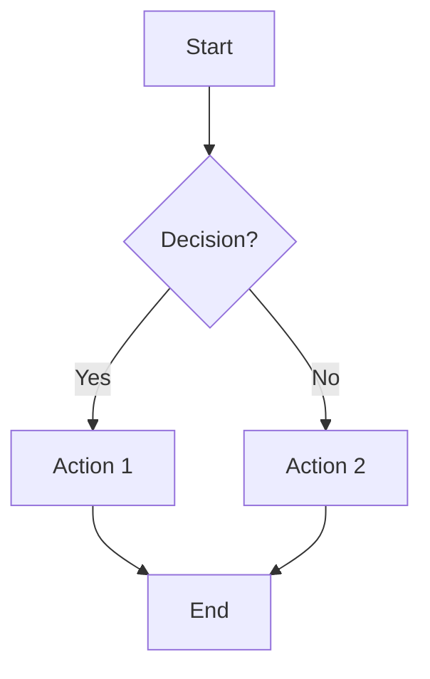
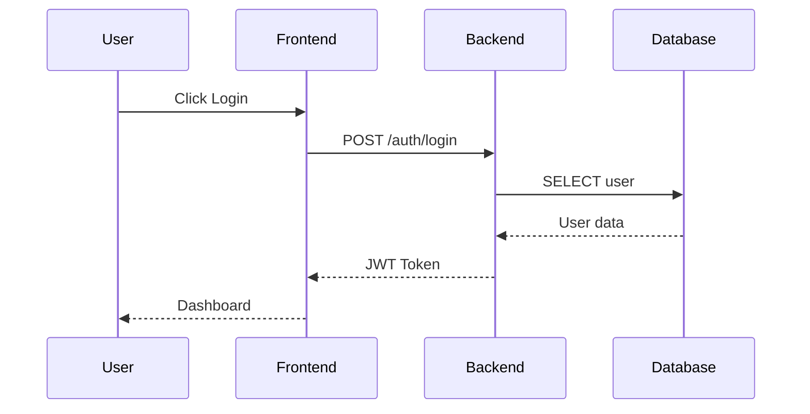
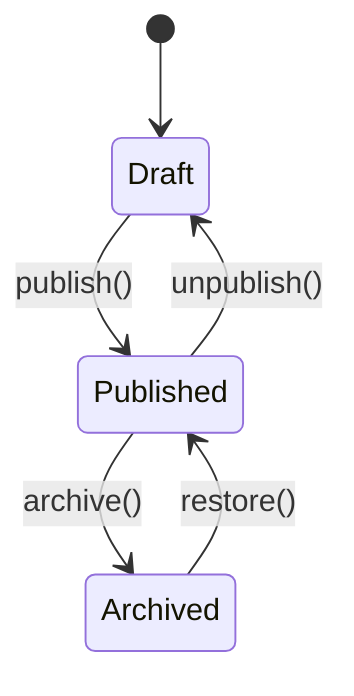
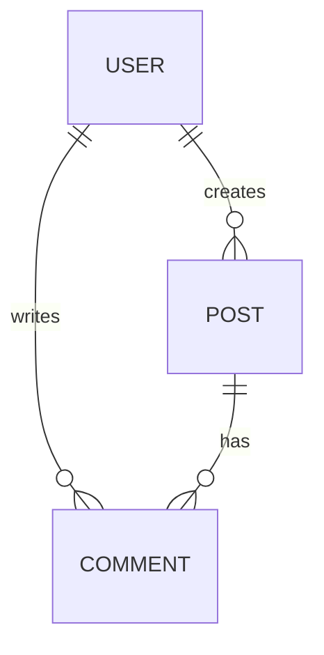
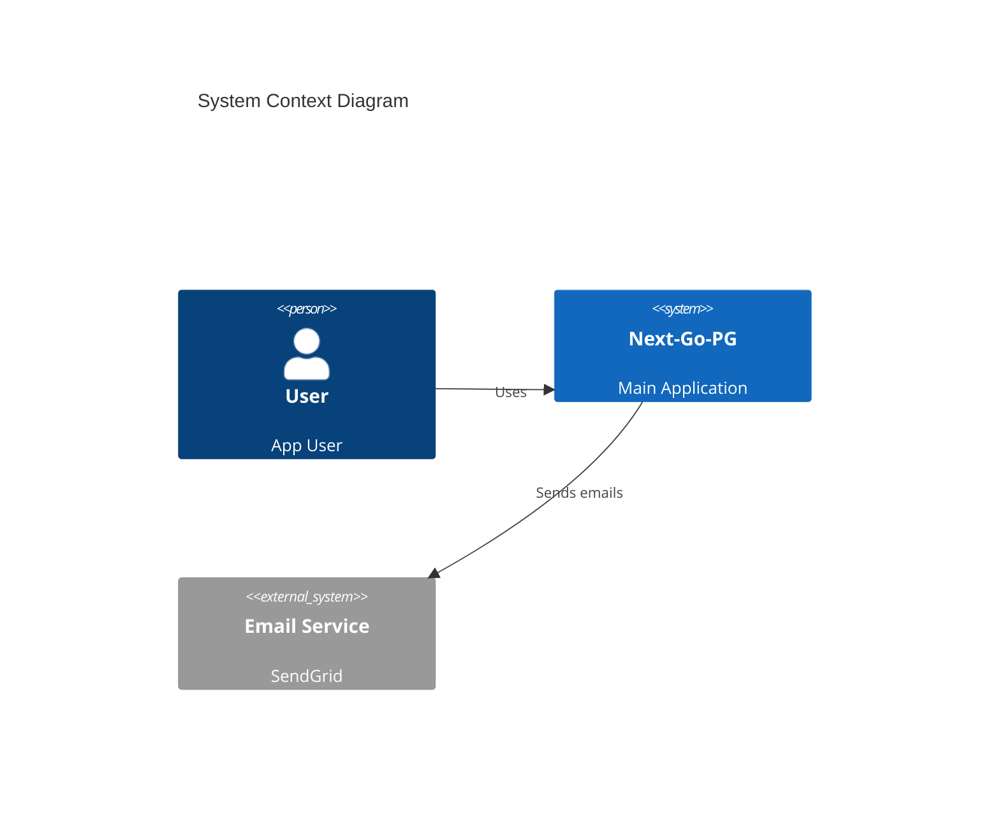

# System Design & Architecture Concepts

Mermaid-based diagrams for business logic, system design and architecture.

## Structure

```
.concepts/
├── README.md                    # This file
├── architecture/                # System Architecture (C4, Deployment)
│   ├── system-context.md        # C4 Level 1: System Context
│   ├── container.md             # C4 Level 2: Container Diagram
│   ├── deployment.md            # Deployment Architecture
│   └── infrastructure.md        # Cloud/Server Infrastructure
├── flows/                       # Business Logic & Workflows
│   ├── auth-flow.md             # Authentication Flow
│   ├── user-journey.md          # User Journey Maps
│   └── data-flow.md             # Data Flow Diagrams
└── data-models/                 # Data & Entity Models
    ├── er-diagram.md            # Entity Relationship Diagram
    ├── class-diagram.md         # Class/Domain Model
    └── state-machines.md        # State Diagrams
```

## Mermaid Diagram Types

### Architecture & Infrastructure
| Type | Usage |
|------|-------|
| **C4 Diagram** | System Context, Container, Component |
| **Block Diagram** | System component connections |
| **Deployment** | Server/Cloud Infrastructure |

### Business Logic & Flows
| Type | Usage |
|------|-------|
| **Flowchart** | Workflows, processes, decisions |
| **Sequence Diagram** | API calls, service interactions |
| **State Diagram** | Object states, state machines |
| **User Journey** | UX flows, customer journey |

### Data & Relationships
| Type | Usage |
|------|-------|
| **ER Diagram** | Database relations |
| **Class Diagram** | Domain models, OOP structures |
| **Mind Map** | Brainstorming, hierarchies |

### Planning & Visualization
| Type | Usage |
|------|-------|
| **Gantt Chart** | Project timeline, sprints |
| **Timeline** | Events chronologically |
| **Pie Chart** | Proportions, statistics |
| **Sankey Diagram** | Flow distribution |
| **XY Chart** | Data visualization |
| **Quadrant Chart** | 2x2 matrix (e.g., priorities) |

## Quick Reference

### Flowchart


### Sequence Diagram


### State Diagram


### ER Diagram


### C4 Context


## Usage

1. **Create new concept:** `/.concept <name>` or manually create in `.concepts/`
2. **Choose diagram type:** Appropriate for the use case (see table above)
3. **Describe business logic:** Text first, then Mermaid
4. **Link in code:** Reference in code comments

## VSCode Preview

Install the extension "Markdown Preview Mermaid Support" for live preview:
```
ext install bierner.markdown-mermaid
```
