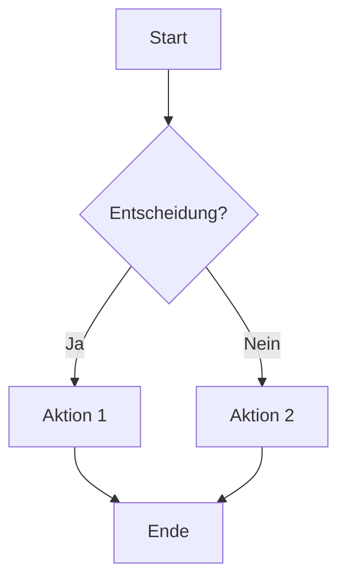
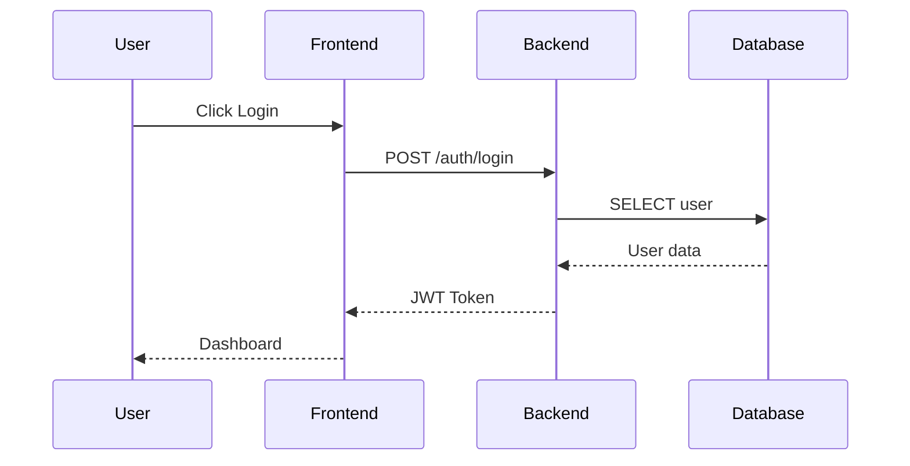
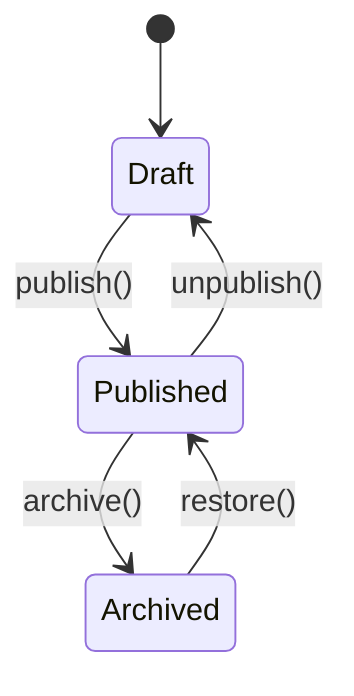
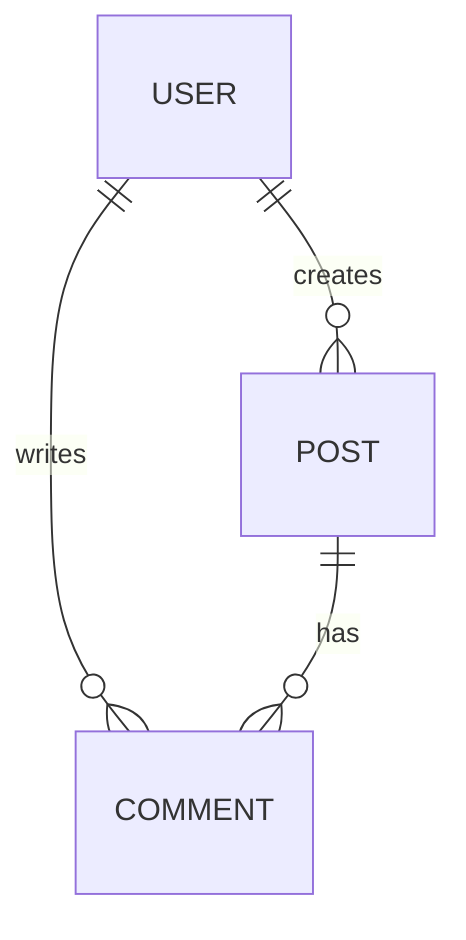
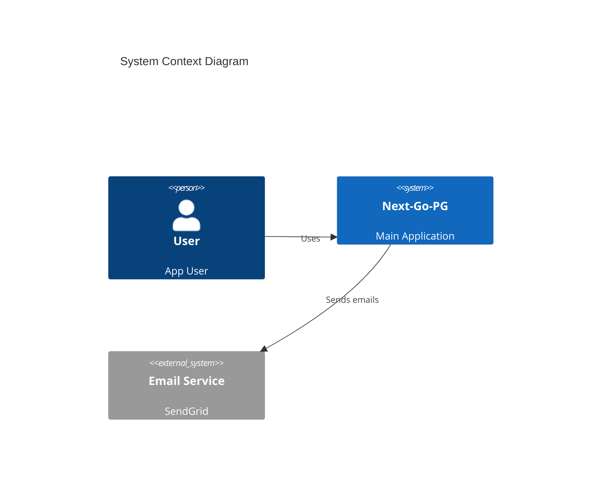

# System Design & Architecture Concepts

Mermaid-basierte Diagramme für Business Logik, System Design und Architecture.

## Struktur

```
.concepts/
├── README.md                    # Diese Datei
├── architecture/                # System Architecture (C4, Deployment)
│   ├── system-context.md        # C4 Level 1: System Context
│   ├── container.md             # C4 Level 2: Container Diagram
│   ├── deployment.md            # Deployment Architecture
│   └── infrastructure.md        # Cloud/Server Infrastructure
├── flows/                       # Business Logic & Workflows
│   ├── auth-flow.md             # Authentication Flow
│   ├── user-journey.md          # User Journey Maps
│   └── data-flow.md             # Data Flow Diagrams
└── data-models/                 # Data & Entity Models
    ├── er-diagram.md            # Entity Relationship Diagram
    ├── class-diagram.md         # Class/Domain Model
    └── state-machines.md        # State Diagrams
```

## Mermaid Diagram Types

### Architecture & Infrastructure
| Typ | Verwendung |
|-----|------------|
| **C4 Diagram** | System Context, Container, Component |
| **Block Diagram** | System-Komponenten Verbindungen |
| **Deployment** | Server/Cloud Infrastructure |

### Business Logic & Flows
| Typ | Verwendung |
|-----|------------|
| **Flowchart** | Workflows, Prozesse, Entscheidungen |
| **Sequence Diagram** | API Calls, Service Interaktionen |
| **State Diagram** | Objekt-Zustände, State Machines |
| **User Journey** | UX Flows, Customer Journey |

### Data & Relationships
| Typ | Verwendung |
|-----|------------|
| **ER Diagram** | Datenbank-Relationen |
| **Class Diagram** | Domain Models, OOP Strukturen |
| **Mind Map** | Brainstorming, Hierarchien |

### Planning & Visualization
| Typ | Verwendung |
|-----|------------|
| **Gantt Chart** | Projekt-Timeline, Sprints |
| **Timeline** | Events chronologisch |
| **Pie Chart** | Proportionen, Statistiken |
| **Sankey Diagram** | Flow-Verteilung |
| **XY Chart** | Daten-Visualisierung |
| **Quadrant Chart** | 2x2 Matrix (z.B. Prioritäten) |

## Quick Reference

### Flowchart


### Sequence Diagram


### State Diagram


### ER Diagram


### C4 Context


## Verwendung

1. **Neues Concept erstellen:** `/.concept <name>` oder manuell in `.concepts/` anlegen
2. **Diagramm-Typ wählen:** Passend zum Use Case (siehe Tabelle oben)
3. **Business Logic beschreiben:** Zuerst Text, dann Mermaid
4. **In Code verlinken:** Referenz in Code-Kommentaren

## VSCode Preview

Installiere die Extension "Markdown Preview Mermaid Support" für Live-Preview:
```
ext install bierner.markdown-mermaid
```
