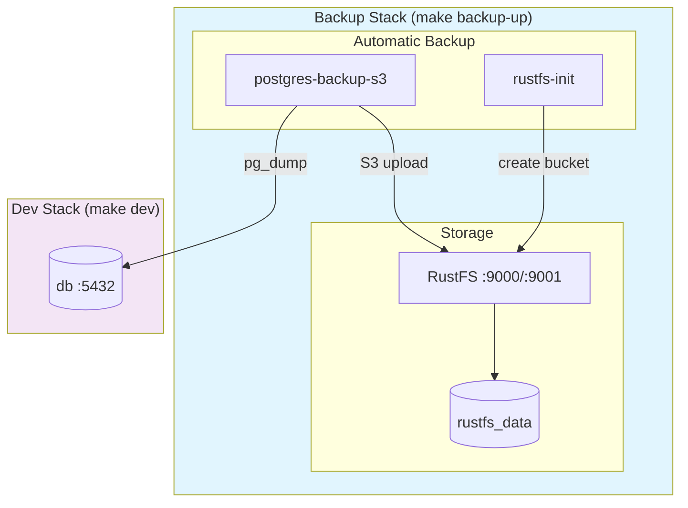
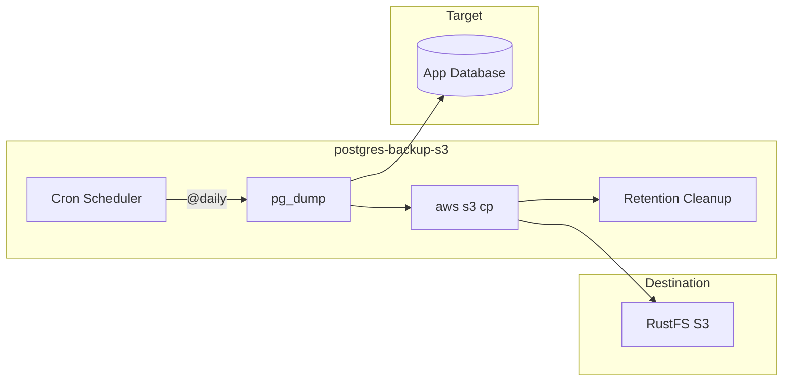
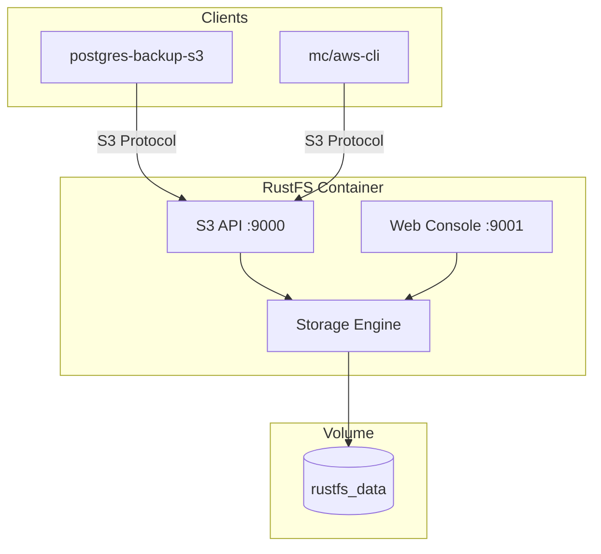
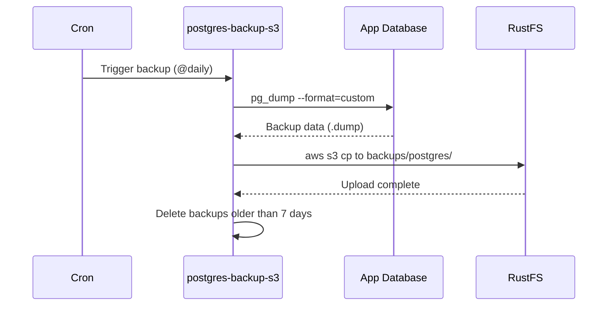
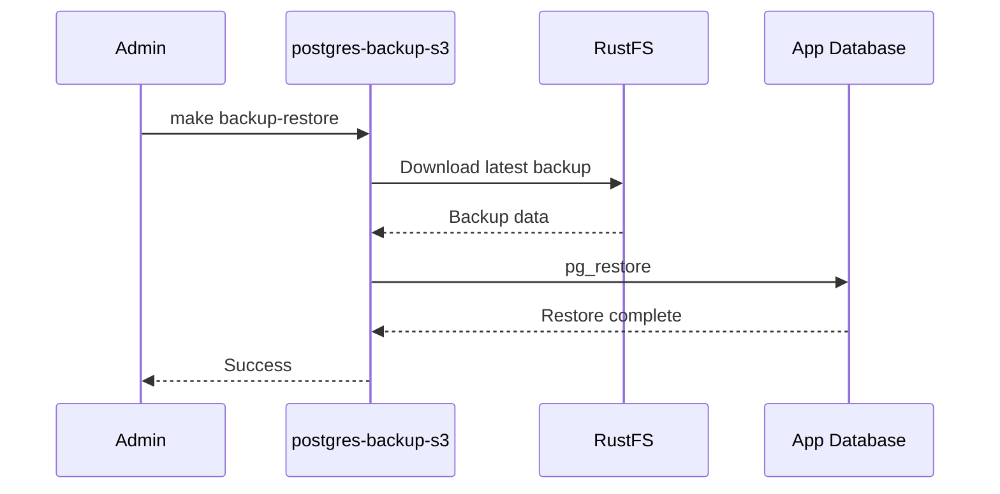
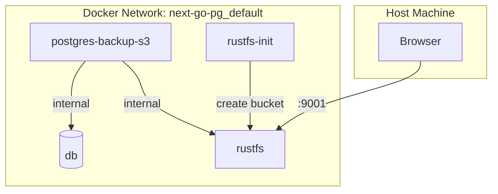
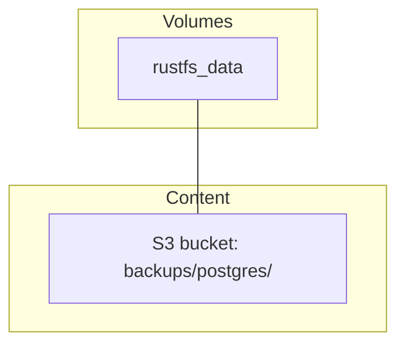
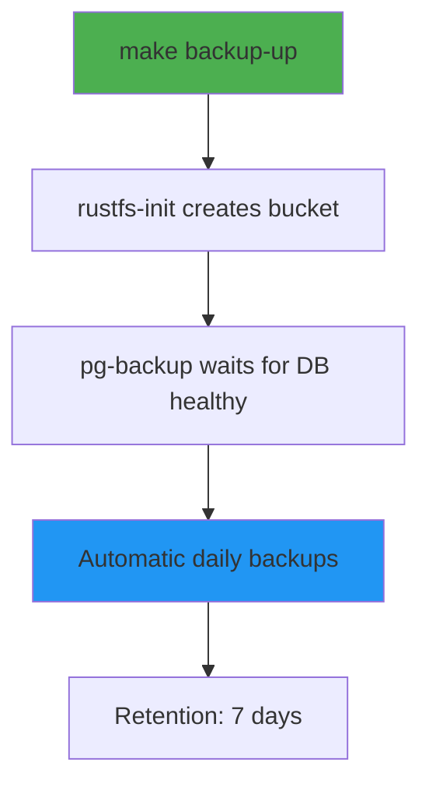

# Backup Stack Architecture

Fully automatic PostgreSQL backup system with RustFS (S3-compatible storage).

## Stack Overview



## Component Details

### postgres-backup-s3

Automatic PostgreSQL backup container with S3 upload.



**Features:**
- Fully automatic (cron-based)
- Zero configuration via environment variables
- S3-compatible storage support
- Configurable retention policy
- Compression (custom format)

### RustFS

S3-compatible object storage (MinIO alternative, written in Rust).



**Features:**
- S3-compatible API
- Web console for management
- Bucket management
- Lightweight (~20MB)
- Active development (Rust-based)

## Data Flow

### Backup Flow



### Restore Flow



## Network Architecture



## Docker Compose Services

| Service | Image | Ports | Purpose |
|---------|-------|-------|---------|
| `rustfs` | rustfs/rustfs | 9000, 9001 | S3-compatible storage |
| `rustfs-init` | minio/mc | - | Auto-create bucket on startup |
| `pg-backup` | eeshugerman/postgres-backup-s3:16 | - | Automatic backups |

## Volume Structure



## Setup Workflow



**No manual configuration required!**

## Environment Variables

| Variable | Default | Description |
|----------|---------|-------------|
| `S3_ACCESS_KEY` | rustfsadmin | RustFS access key |
| `S3_SECRET_KEY` | rustfsadmin | RustFS secret key |
| `BACKUP_SCHEDULE` | @daily | Cron schedule for backups |
| `BACKUP_KEEP_DAYS` | 7 | Days to keep backups |
| `POSTGRES_DB` | nextgopg | Database name |
| `POSTGRES_USER` | postgres | Database user |
| `POSTGRES_PASSWORD` | postgres | Database password |

## Makefile Commands

```bash
make backup-up       # Start automatic backup system
make backup-down     # Stop backup stack
make backup-now      # Create backup immediately
make backup-list     # List all backups in S3
make backup-restore  # Restore from latest backup
```

## Console Access

RustFS Web Console: http://localhost:9001/rustfs/console/

Default credentials:
- Access Key: `rustfsadmin`
- Secret Key: `rustfsadmin`
