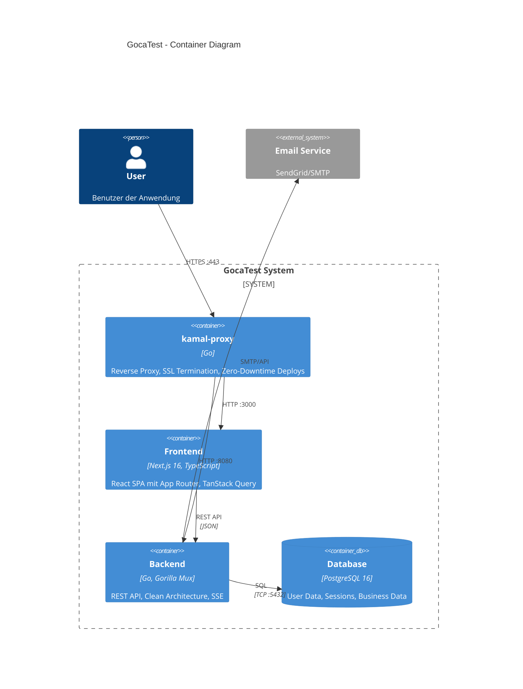
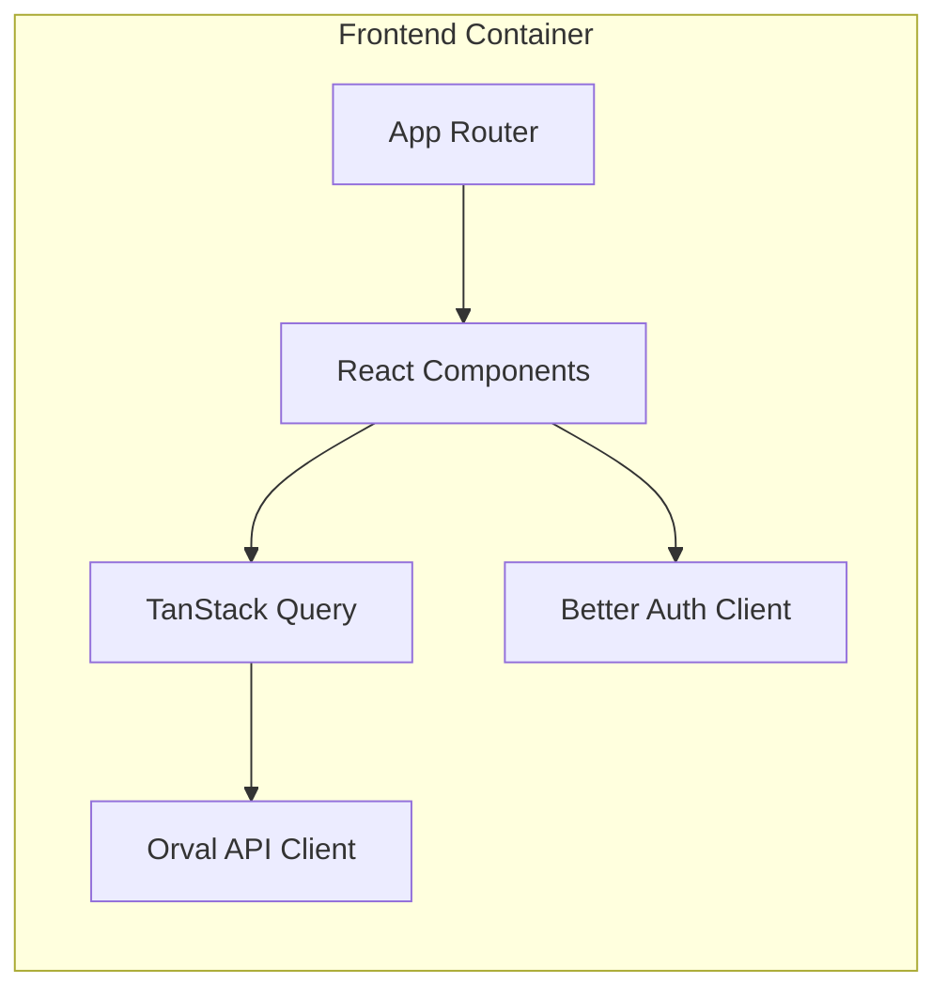
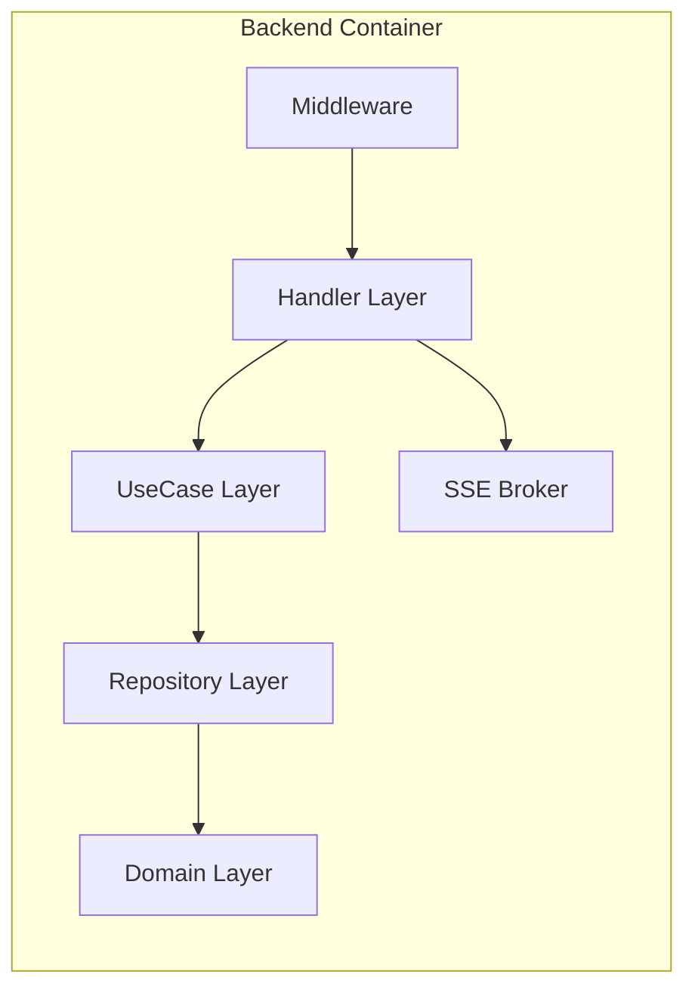
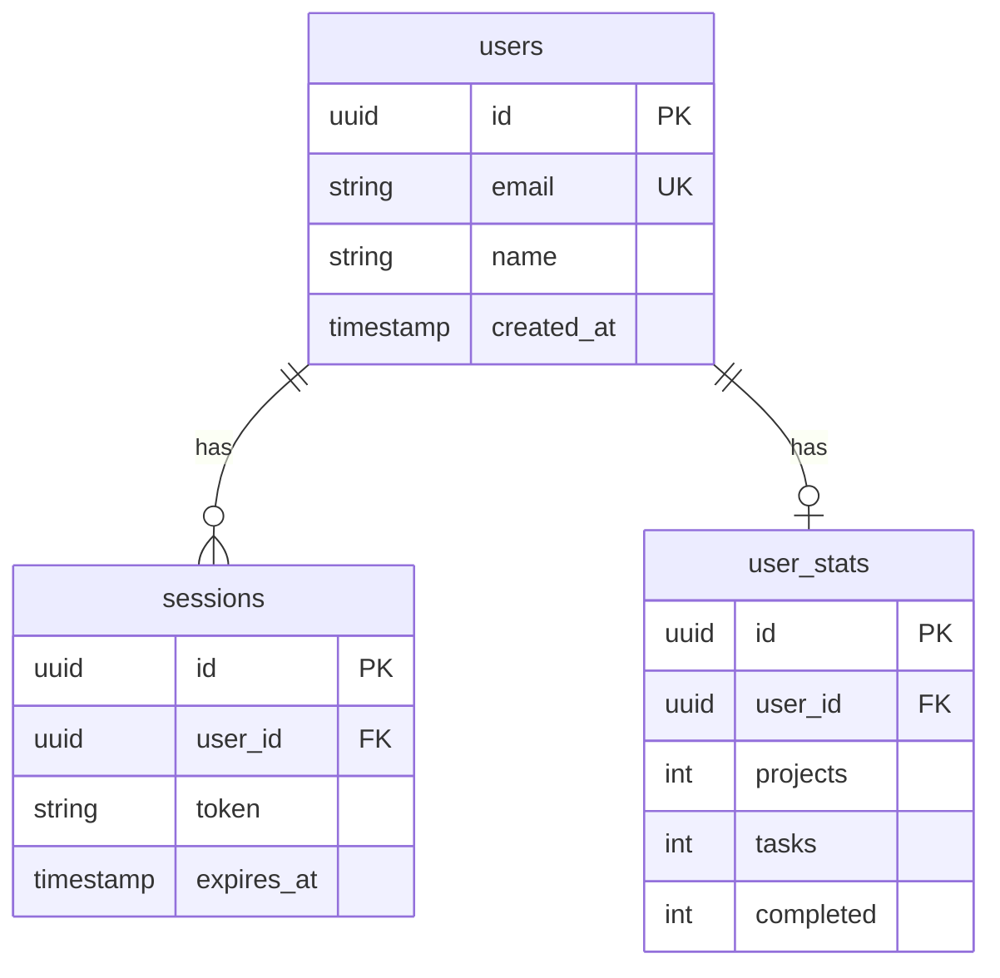
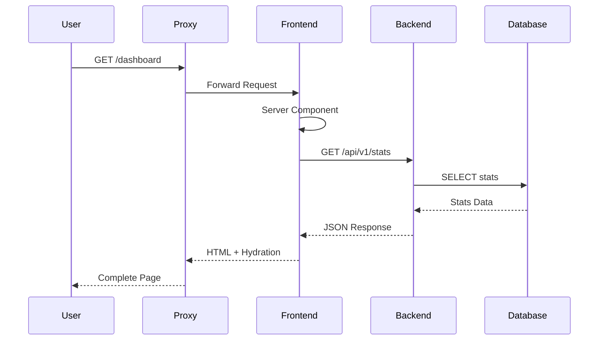
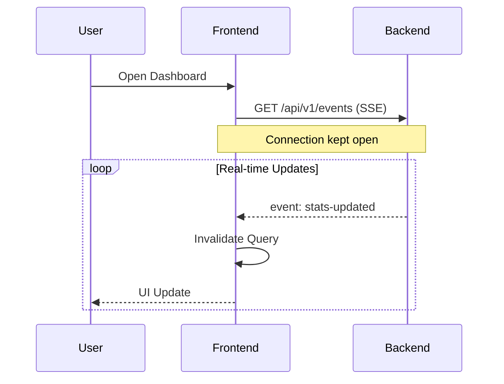

# Container Diagram (C4 Level 2)

## Technische Architektur

Detaillierte Sicht auf die Container (deploybare Einheiten) des Systems.

## Container Diagram

## Container Details

### Frontend (Next.js)

| Komponente | Technologie | Verantwortung |
|------------|-------------|---------------|
| App Router | Next.js 16 | Routing, SSR, Server Components |
| Components | React + shadcn/ui | UI Rendering |
| TanStack Query | React Query | Server State, Caching |
| Better Auth | Auth Client | Session Management |
| Orval | Generated Hooks | Type-safe API Calls |

### Backend (Go)

| Layer | Verantwortung | Goca Command |
|-------|---------------|--------------|
| Handler | HTTP Endpoints, Swagger | `goca make handler` |
| UseCase | Business Logic | `goca make usecase` |
| Repository | Data Access | `goca make repository` |
| Domain | Entities, Rules | `goca make entity` |

### Database Schema

## Kommunikation

### Synchrone Kommunikation

### Asynchrone Kommunikation (SSE)

