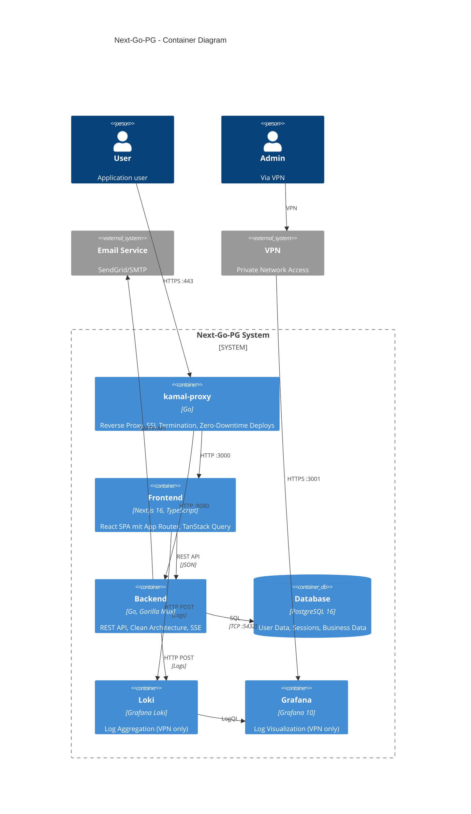
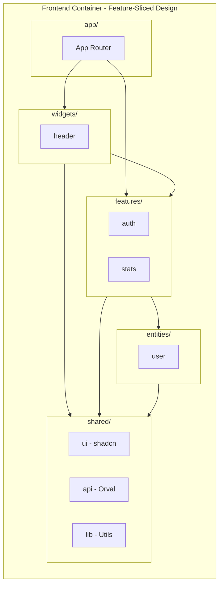
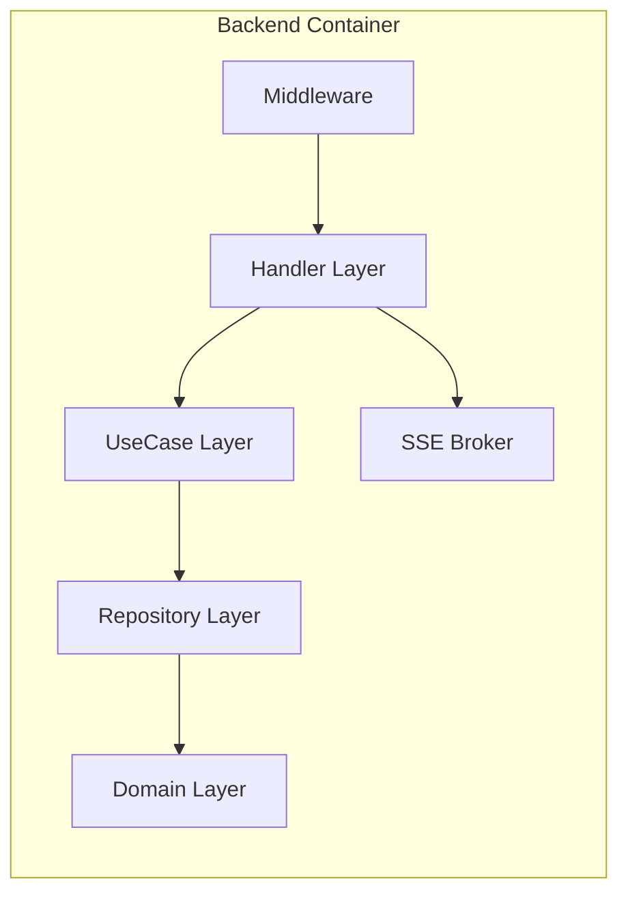
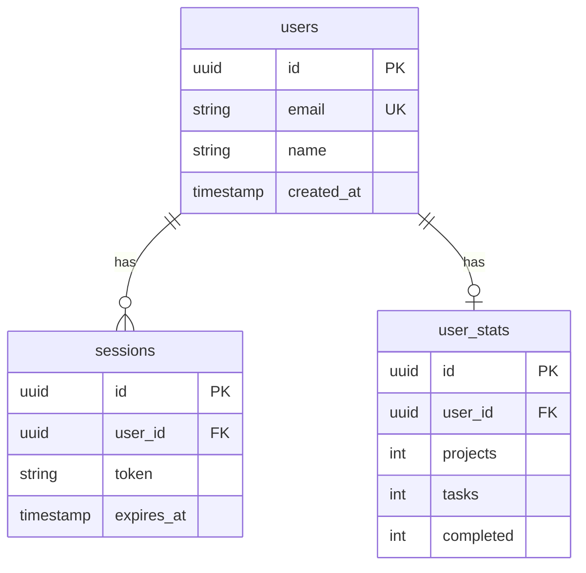
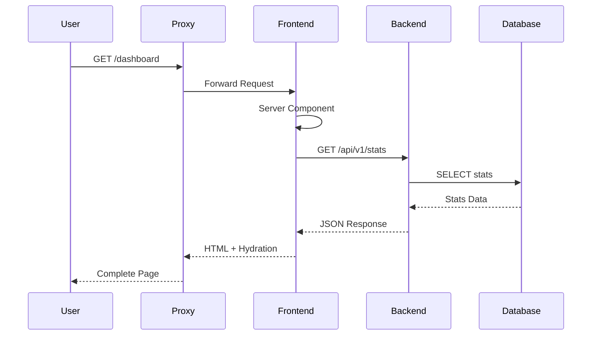
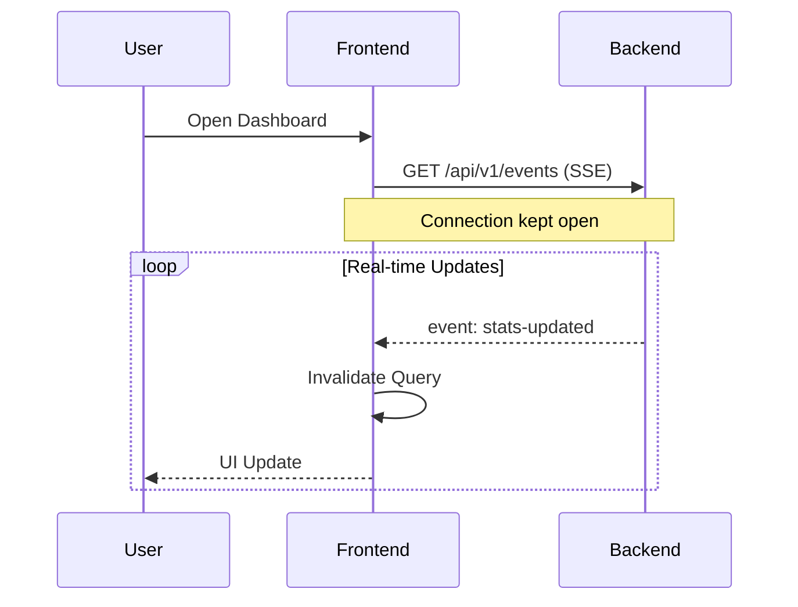

# Container Diagram (C4 Level 2)

## Technical Architecture

Detailed view of the containers (deployable units) of the system.

## Container Diagram

## Container Details

### Frontend (Next.js + FSD)

| Layer | Technology | Responsibility |
|-------|------------|----------------|
| app/ | Next.js 16 App Router | Routing, SSR, Pages |
| widgets/ | React Components | Composite UI (Header) |
| features/ | React + Hooks | User Interactions (Auth, Stats) |
| entities/ | TypeScript | Business Objects (User) |
| shared/ui | shadcn/ui | UI Components |
| shared/api | Orval + TanStack Query | Type-safe API Calls |
| shared/lib | Better Auth, Utils | Auth, Helpers |

### Backend (Go)

| Layer | Responsibility | Goca Command |
|-------|----------------|--------------|
| Handler | HTTP Endpoints, Swagger | `goca make handler` |
| UseCase | Business Logic | `goca make usecase` |
| Repository | Data Access | `goca make repository` |
| Domain | Entities, Rules | `goca make entity` |

### Database Schema

## Communication

### Synchronous Communication

### Asynchronous Communication (SSE)

