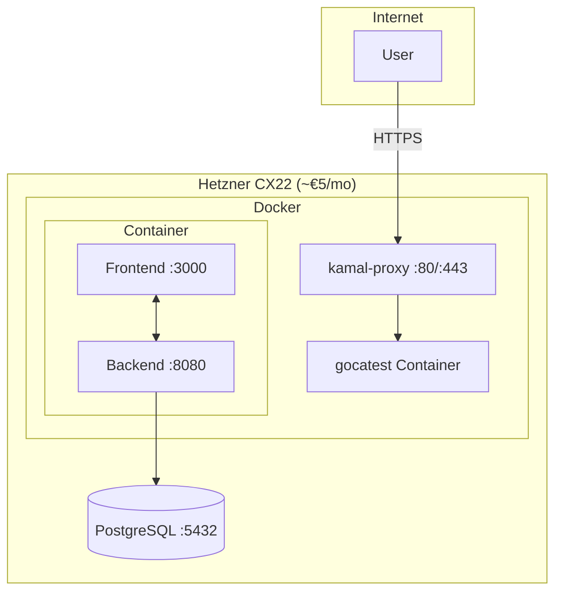
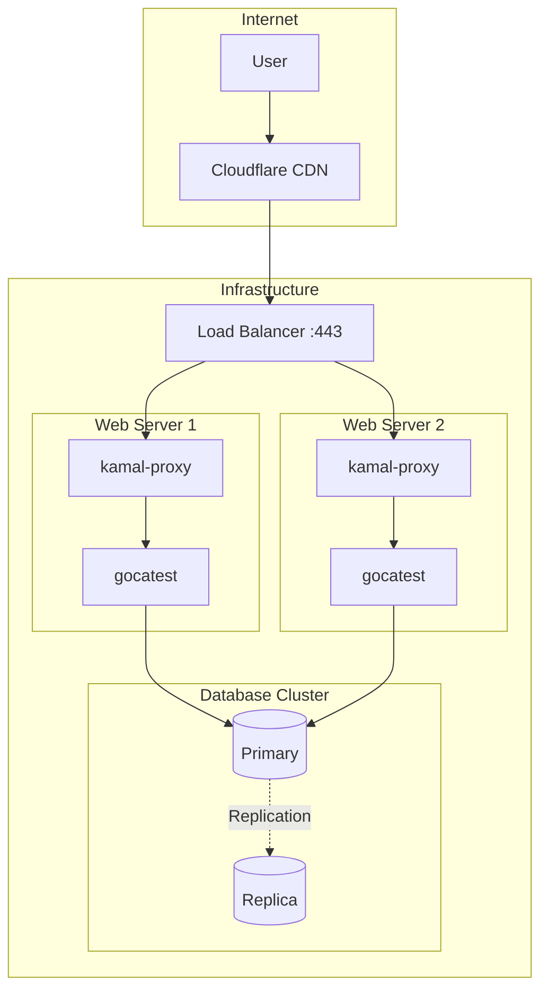
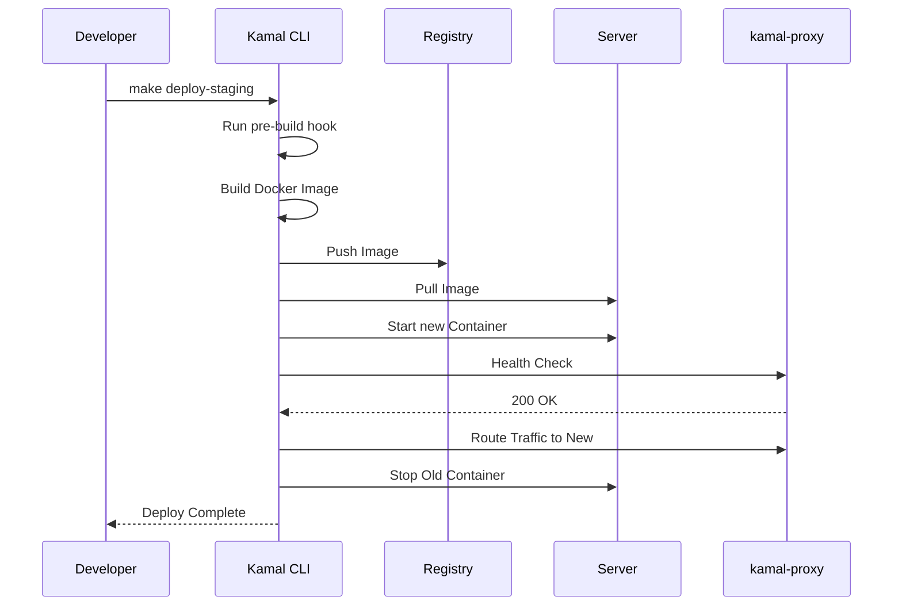
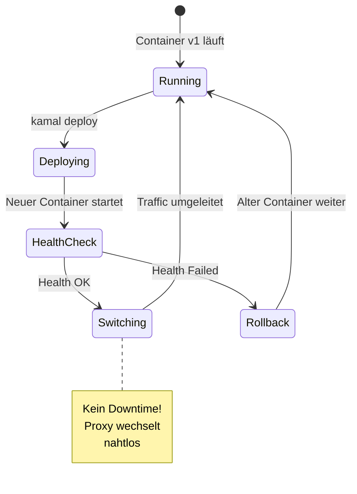
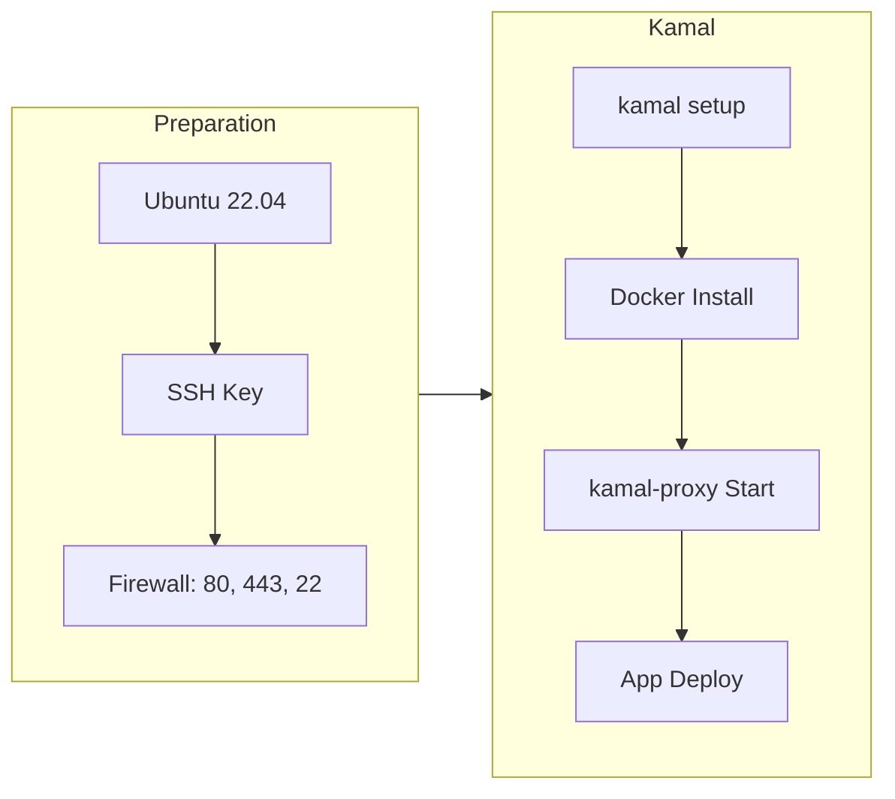
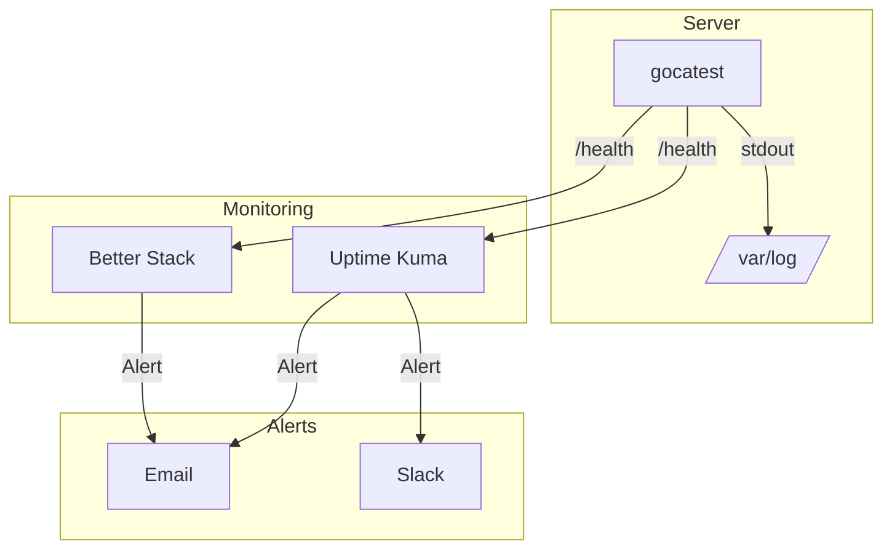
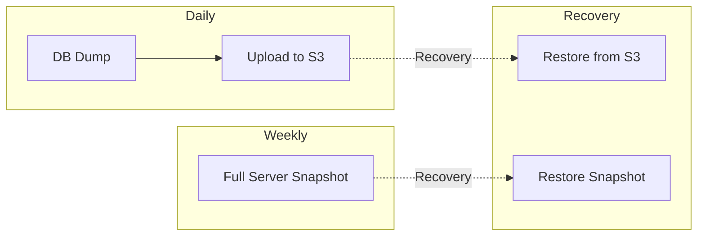

# Deployment Architecture

## Deployment-Strategien

### Single Server (Phase 1)

Einfachste Konfiguration für Start und kleine Last.

**Vorteile:**
- Günstig (~€5-15/Monat)
- Einfach zu verwalten
- Zero-Downtime Deploys

**Nachteile:**
- Single Point of Failure
- Keine horizontale Skalierung

### Multi-Server mit Load Balancer (Phase 2)

Für höhere Verfügbarkeit und Last.

**Vorteile:**
- High Availability
- Horizontale Skalierung
- Failover möglich

**Kosten:**
- 2x Web Server: ~€20
- Load Balancer: ~€5
- Managed DB: ~€15
- **Total: ~€40-50/Monat**

## Kamal Deployment Flow

## Zero-Downtime Deploy

## Server Setup

## Monitoring & Logging

## Backup Strategy

