# Failover-Szenarien: Konkrete Fallbeispiele

Dieses Dokument zeigt anhand realer Szenarien, wie die HA-Architektur Ausfälle abfängt.

---

## Szenario 1: Datenbank-Server stürzt ab

**Situation:** Der Primary PostgreSQL-Server hat um 03:14 Uhr einen Kernel Panic und fällt komplett aus.

### Timeline des Ausfalls

### Was passiert auf jeder Ebene?

### User Experience

| Ohne HA | Mit HA |
|---------|--------|
| Kompletter Ausfall | 22 Sekunden Unterbrechung |
| Manuelles Eingreifen nötig | Automatisches Failover |
| Potentieller Datenverlust | 0 Datenverlust (sync replication) |
| Downtime: Stunden | Downtime: < 30 Sekunden |

---

## Szenario 2: Netzwerk-Partition (Split-Brain Gefahr)

**Situation:** Ein Netzwerkfehler trennt den Primary vom Rest des Clusters.

### Das Problem ohne Schutz

```mermaid
flowchart TB
    subgraph Danger["GEFAHR: Split-Brain"]
        subgraph Network1["Netzwerk A"]
            Client1[Client A]
            P1_bad[(Primary<br/>isoliert)]
        end

        subgraph Network2["Netzwerk B"]
            Client2[Client B]
            P2_bad[(Replica<br/>promoted)]
        end

        Client1 -->|"Write: balance=100"| P1_bad
        Client2 -->|"Write: balance=50"| P2_bad

        P1_bad -.->|"❌ Keine Verbindung"| P2_bad
    end

    subgraph Result["Resultat"]
        Conflict[Datenkonflikt!<br/>Welcher Wert ist korrekt?]
    end

    Danger --> Conflict

    style Danger fill:#ffcccc
    style Conflict fill:#ff0000,color:#fff
```

### Die Lösung: etcd Quorum + Fencing

### Fencing-Mechanismus im Detail

```mermaid
flowchart TB
    subgraph Primary["Isolierter Primary"]
        Check[Patroni prüft etcd]
        Decision{Kann etcd<br/>erreichen?}
        Continue[Weiter als Primary]
        Demote[SELBST-DEGRADIERUNG]
        ReadOnly[Nur noch Read-Only]
    end

    subgraph Protection["Schutzmaßnahmen"]
        NoWrite[Writes werden abgelehnt]
        NoLease[Leader-Lease läuft ab]
        Alert[Alert: Primary degradiert]
    end

    Check --> Decision
    Decision -->|Ja| Continue
    Decision -->|Nein| Demote
    Demote --> ReadOnly
    ReadOnly --> NoWrite & NoLease & Alert

    style Demote fill:#FFD700
    style ReadOnly fill:#87CEEB
```

---

## Szenario 3: Deployment schlägt fehl

**Situation:** Ein neues Backend-Deployment hat einen Bug und die App crasht beim Start.

### Rolling Deployment mit Health Checks

### Zero-Downtime Deployment (Happy Path)

---

## Szenario 4: DDoS-Angriff

**Situation:** Die Anwendung wird mit 10 Millionen Requests/Sekunde angegriffen.

### Schutzschichten

### Rate Limiting Kaskade

```mermaid
flowchart LR
    subgraph Levels["Rate Limit Ebenen"]
        L1["Edge: 1000 req/s/IP"]
        L2["WAF: 100 req/s/IP"]
        L3["App: 10 req/s/User"]
        L4["API: 1 req/s/Endpoint"]
    end

    subgraph Response["Antwort bei Überschreitung"]
        R1["403 Forbidden<br/>IP geblockt"]
        R2["429 Too Many<br/>Retry-After: 60s"]
        R3["429 Too Many<br/>Retry-After: 10s"]
        R4["429 Too Many<br/>Retry-After: 1s"]
    end

    L1 --> R1
    L2 --> R2
    L3 --> R3
    L4 --> R4
```

---

## Szenario 5: Datacenter-Ausfall

**Situation:** Das gesamte Datacenter in Frankfurt fällt aus (Stromausfall, Naturkatastrophe).

### Multi-Region Failover

### GeoDNS Failover

```mermaid
flowchart TB
    subgraph Normal["Normalbetrieb"]
        EU_User[EU User] -->|"app.example.com"| DNS1[DNS]
        DNS1 -->|"Frankfurt IP"| EU_DC[EU Datacenter]

        US_User[US User] -->|"app.example.com"| DNS2[DNS]
        DNS2 -->|"Virginia IP"| US_DC[US Datacenter]
    end

    subgraph Failover["Nach EU-Ausfall"]
        EU_User2[EU User] -->|"app.example.com"| DNS3[DNS]
        DNS3 -->|"Virginia IP<br/>(nächste Region)"| US_DC2[US Datacenter]

        US_User2[US User] -->|"app.example.com"| DNS4[DNS]
        DNS4 -->|"Virginia IP"| US_DC3[US Datacenter]
    end

    style EU_DC fill:#90EE90
    style US_DC fill:#90EE90
    style US_DC2 fill:#FFD700
    style US_DC3 fill:#90EE90
```

### Daten-Synchronisation zwischen Regionen

---

## Szenario 6: Datenkorruption durch Bug

**Situation:** Ein Bug im Code löscht versehentlich User-Daten.

### Point-in-Time Recovery

```mermaid
sequenceDiagram
    participant Dev as Developer
    participant App as Application
    participant DB as Database
    participant WAL as WAL Archive
    participant S3 as S3 Backup

    Note over App: 14:30 - Bug deployed
    App->>DB: DELETE FROM users WHERE active=true
    Note over DB: 😱 50.000 User gelöscht!

    DB->>WAL: WAL Segment geschrieben
    WAL->>S3: Archiviert

    Note over Dev: 15:45 - Bug entdeckt!

    rect rgb(255, 255, 200)
        Dev->>Dev: Entscheidung: PITR zu 14:29
    end

    rect rgb(200, 255, 200)
        Dev->>S3: Hole Base Backup
        S3-->>Dev: Backup von 00:00
        Dev->>S3: Hole WAL Segmente
        S3-->>Dev: WAL 00:00 - 14:29

        Dev->>Dev: Restore + Replay WAL
        Dev->>Dev: Stoppe bei 14:29:59
    end

    Note over Dev,DB: Daten wiederhergestellt!<br/>Verlust: nur Änderungen 14:29-15:45
```

### Recovery-Optionen

---

## Szenario 7: Memory Leak / OOM

**Situation:** Ein Memory Leak führt dazu, dass der Backend-Pod OOM (Out of Memory) killed wird.

### Kubernetes Self-Healing

### Resource Limits & Monitoring

---

## Szenario 8: SSL-Zertifikat läuft ab

**Situation:** Das SSL-Zertifikat läuft in 7 Tagen ab.

### Automatische Zertifikatserneuerung

### Zertifikats-Monitoring Dashboard

```mermaid
flowchart TB
    subgraph Certs["Zertifikate"]
        Main["app.example.com<br/>Ablauf: 89 Tage ✅"]
        API["api.example.com<br/>Ablauf: 89 Tage ✅"]
        Wild["*.example.com<br/>Ablauf: 25 Tage ⚠️"]
    end

    subgraph Thresholds["Schwellenwerte"]
        T1["< 30 Tage: Auto-Renew"]
        T2["< 14 Tage: Warning"]
        T3["< 7 Tage: Critical"]
        T4["< 1 Tag: EMERGENCY"]
    end

    Certs --> Thresholds

    style Main fill:#90EE90
    style API fill:#90EE90
    style Wild fill:#FFD700
```

---

## Zusammenfassung: Schutzmatrix

| Szenario | Schutz | Recovery | Datenverlust |
|----------|--------|----------|--------------|
| Server Crash | Patroni Failover | < 30s | 0 |
| Netzwerk-Partition | etcd Quorum | < 30s | 0 |
| Bad Deployment | Health Checks | 0s | 0 |
| DDoS Angriff | CDN + WAF | 0s | 0 |
| Datacenter-Ausfall | Multi-Region | < 5min | < 500ms Lag |
| Datenkorruption | PITR | < 1h | Bis zum Bug |
| Memory Leak | K8s Self-Healing | < 1min | 0 |
| Cert Expiry | Auto-Renewal | 0s | 0 |
