# Failover Scenarios: Concrete Case Studies

This document shows how the HA architecture handles failures using real-world scenarios.

---

## Scenario 1: Database Server Crashes

**Situation:** The Primary PostgreSQL server experiences a kernel panic at 03:14 AM and goes down completely.

### Failure Timeline

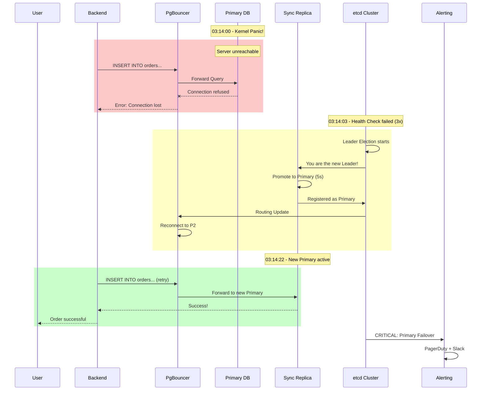
```mermaid
sequenceDiagram
    participant U as User
    participant App as Backend
    participant PGB as PgBouncer
    participant P1 as Primary DB
    participant P2 as Sync Replica
    participant ETCD as etcd Cluster
    participant Alert as Alerting

    Note over P1: 03:14:00 - Kernel Panic!

    rect rgb(255, 200, 200)
        Note over P1: Server unreachable
        App->>PGB: INSERT INTO orders...
        PGB->>P1: Forward Query
        P1--xPGB: Connection refused
        PGB-->>App: Error: Connection lost
    end

    Note over ETCD: 03:14:03 - Health Check failed (3x)

    rect rgb(255, 255, 200)
        ETCD->>ETCD: Leader Election starts
        ETCD->>P2: You are the new Leader!
        P2->>P2: Promote to Primary (5s)
        P2->>ETCD: Registered as Primary
        ETCD->>PGB: Routing Update
        PGB->>PGB: Reconnect to P2
    end

    Note over P2: 03:14:22 - New Primary active

    rect rgb(200, 255, 200)
        App->>PGB: INSERT INTO orders... (retry)
        PGB->>P2: Forward to new Primary
        P2-->>App: Success!
        App-->>U: Order successful
    end

    ETCD->>Alert: CRITICAL: Primary Failover
    Alert->>Alert: PagerDuty + Slack
```

### What Happens at Each Level?

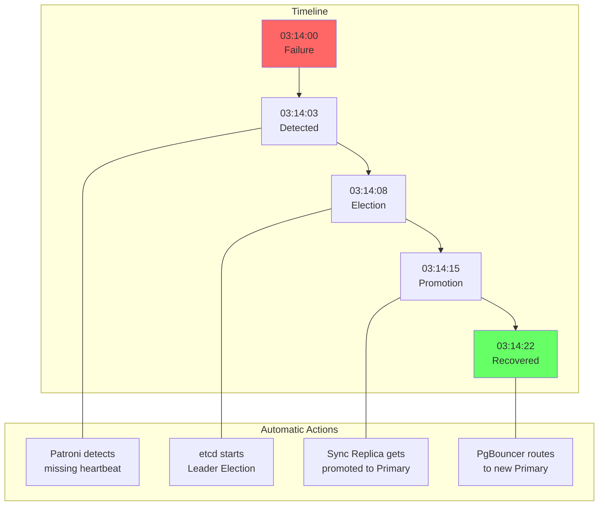
```mermaid
flowchart TB
    subgraph Timeline["Timeline"]
        T0["03:14:00<br/>Failure"]
        T1["03:14:03<br/>Detected"]
        T2["03:14:08<br/>Election"]
        T3["03:14:15<br/>Promotion"]
        T4["03:14:22<br/>Recovered"]
    end

    subgraph Actions["Automatic Actions"]
        A1[Patroni detects<br/>missing heartbeat]
        A2[etcd starts<br/>Leader Election]
        A3[Sync Replica gets<br/>promoted to Primary]
        A4[PgBouncer routes<br/>to new Primary]
    end

    T0 --> T1 --> T2 --> T3 --> T4
    T1 --- A1
    T2 --- A2
    T3 --- A3
    T4 --- A4

    style T0 fill:#ff6666
    style T4 fill:#66ff66
```

### User Experience

| Without HA | With HA |
|------------|---------|
| Complete outage | 22 seconds interruption |
| Manual intervention required | Automatic failover |
| Potential data loss | 0 data loss (sync replication) |
| Downtime: Hours | Downtime: < 30 seconds |

---

## Scenario 2: Network Partition (Split-Brain Risk)

**Situation:** A network failure isolates the Primary from the rest of the cluster.

### The Problem Without Protection

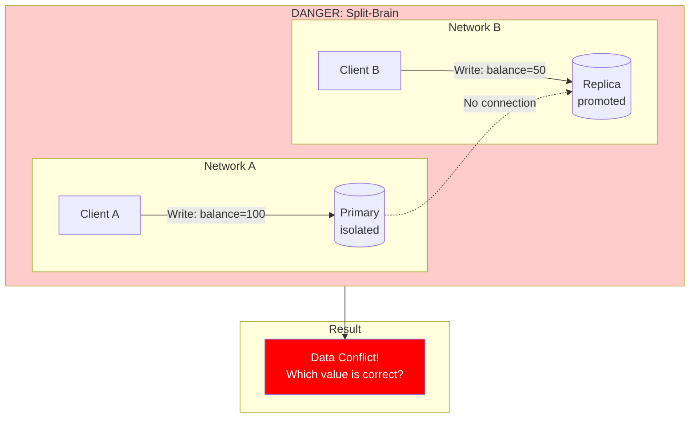
```mermaid
flowchart TB
    subgraph Danger["DANGER: Split-Brain"]
        subgraph Network1["Network A"]
            Client1[Client A]
            P1_bad[(Primary<br/>isolated)]
        end

        subgraph Network2["Network B"]
            Client2[Client B]
            P2_bad[(Replica<br/>promoted)]
        end

        Client1 -->|"Write: balance=100"| P1_bad
        Client2 -->|"Write: balance=50"| P2_bad

        P1_bad -.->|"No connection"| P2_bad
    end

    subgraph Result["Result"]
        Conflict[Data Conflict!<br/>Which value is correct?]
    end

    Danger --> Conflict

    style Danger fill:#ffcccc
    style Conflict fill:#ff0000,color:#fff
```

### The Solution: etcd Quorum + Fencing

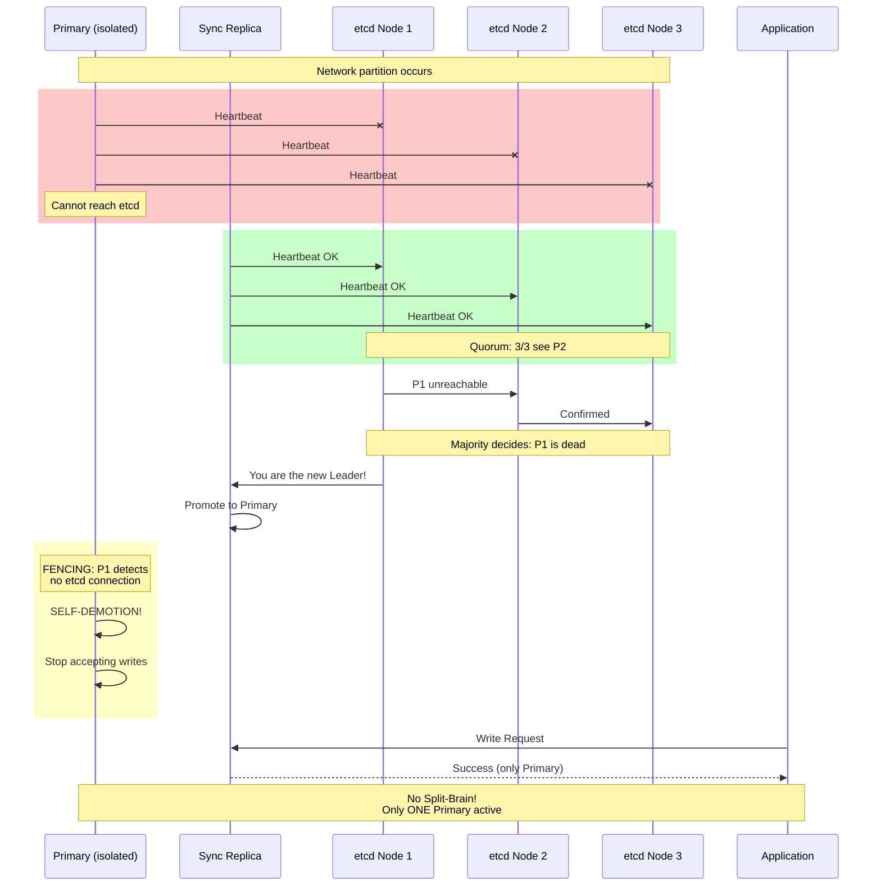
```mermaid
sequenceDiagram
    participant P1 as Primary (isolated)
    participant P2 as Sync Replica
    participant E1 as etcd Node 1
    participant E2 as etcd Node 2
    participant E3 as etcd Node 3
    participant App as Application

    Note over P1,E3: Network partition occurs

    rect rgb(255, 200, 200)
        P1-xE1: Heartbeat
        P1-xE2: Heartbeat
        P1-xE3: Heartbeat
        Note over P1: Cannot reach etcd
    end

    rect rgb(200, 255, 200)
        P2->>E1: Heartbeat OK
        P2->>E2: Heartbeat OK
        P2->>E3: Heartbeat OK
        Note over E1,E3: Quorum: 3/3 see P2
    end

    E1->>E2: P1 unreachable
    E2->>E3: Confirmed
    Note over E1,E3: Majority decides: P1 is dead

    E1->>P2: You are the new Leader!
    P2->>P2: Promote to Primary

    rect rgb(255, 255, 200)
        Note over P1: FENCING: P1 detects<br/>no etcd connection
        P1->>P1: SELF-DEMOTION!
        P1->>P1: Stop accepting writes
    end

    App->>P2: Write Request
    P2-->>App: Success (only Primary)

    Note over P1,App: No Split-Brain!<br/>Only ONE Primary active
```

### Fencing Mechanism in Detail

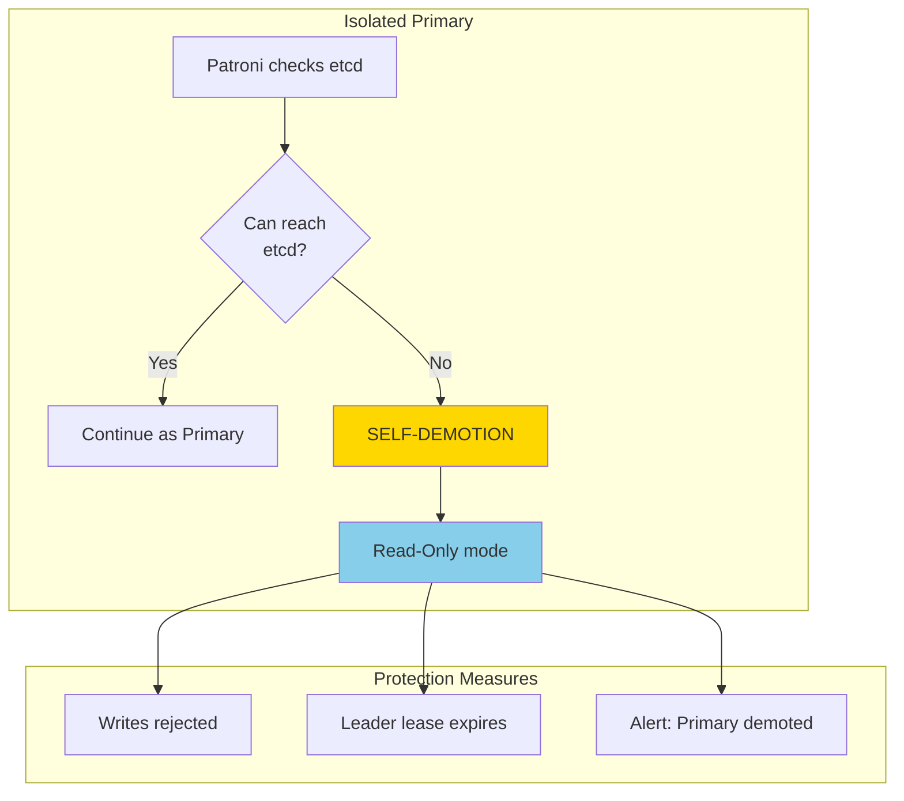
```mermaid
flowchart TB
    subgraph Primary["Isolated Primary"]
        Check[Patroni checks etcd]
        Decision{Can reach<br/>etcd?}
        Continue[Continue as Primary]
        Demote[SELF-DEMOTION]
        ReadOnly[Read-Only mode]
    end

    subgraph Protection["Protection Measures"]
        NoWrite[Writes rejected]
        NoLease[Leader lease expires]
        Alert[Alert: Primary demoted]
    end

    Check --> Decision
    Decision -->|Yes| Continue
    Decision -->|No| Demote
    Demote --> ReadOnly
    ReadOnly --> NoWrite & NoLease & Alert

    style Demote fill:#FFD700
    style ReadOnly fill:#87CEEB
```

---

## Scenario 3: Deployment Fails

**Situation:** A new backend deployment has a bug and the app crashes on startup.

### Rolling Deployment with Health Checks

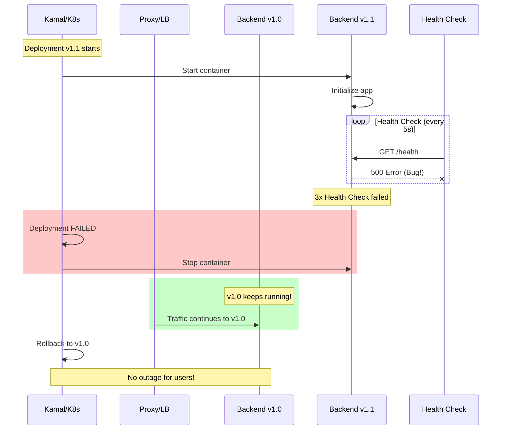
```mermaid
sequenceDiagram
    participant K as Kamal/K8s
    participant P as Proxy/LB
    participant Old as Backend v1.0
    participant New as Backend v1.1
    participant HC as Health Check

    Note over K: Deployment v1.1 starts

    K->>New: Start container
    New->>New: Initialize app

    loop Health Check (every 5s)
        HC->>New: GET /health
        New--xHC: 500 Error (Bug!)
    end

    Note over New: 3x Health Check failed

    rect rgb(255, 200, 200)
        K->>K: Deployment FAILED
        K->>New: Stop container
    end

    rect rgb(200, 255, 200)
        Note over Old: v1.0 keeps running!
        P->>Old: Traffic continues to v1.0
    end

    K->>K: Rollback to v1.0
    Note over K,Old: No outage for users!
```

### Zero-Downtime Deployment (Happy Path)

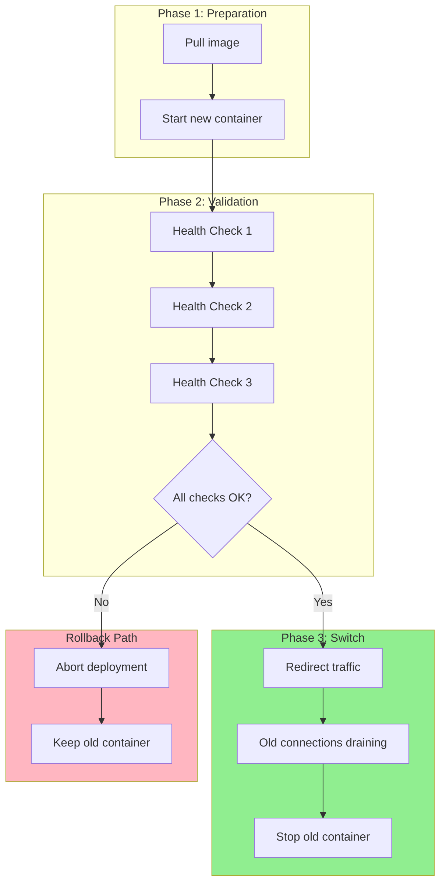
```mermaid
flowchart TB
    subgraph Phase1["Phase 1: Preparation"]
        Pull[Pull image]
        Start[Start new container]
    end

    subgraph Phase2["Phase 2: Validation"]
        HC1[Health Check 1]
        HC2[Health Check 2]
        HC3[Health Check 3]
        Ready{All checks OK?}
    end

    subgraph Phase3["Phase 3: Switch"]
        Route[Redirect traffic]
        Drain[Old connections draining]
        Stop[Stop old container]
    end

    subgraph Rollback["Rollback Path"]
        Fail[Abort deployment]
        Keep[Keep old container]
    end

    Pull --> Start --> HC1 --> HC2 --> HC3 --> Ready
    Ready -->|Yes| Route --> Drain --> Stop
    Ready -->|No| Fail --> Keep

    style Phase3 fill:#90EE90
    style Rollback fill:#FFB6C1
```

---

## Scenario 4: DDoS Attack

**Situation:** The application is attacked with 10 million requests/second.

### Protection Layers

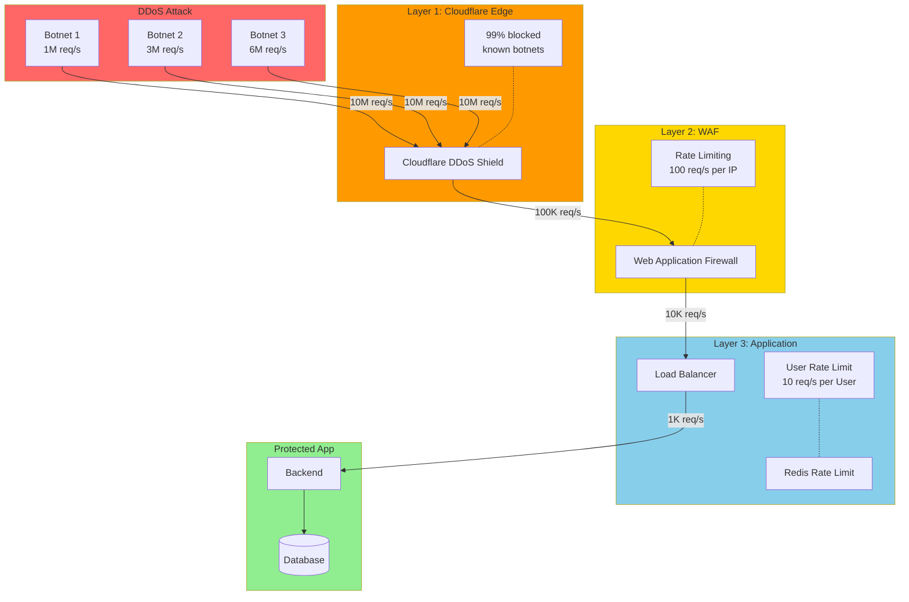
```mermaid
flowchart TB
    subgraph Attack["DDoS Attack"]
        Bot1[Botnet 1<br/>1M req/s]
        Bot2[Botnet 2<br/>3M req/s]
        Bot3[Botnet 3<br/>6M req/s]
    end

    subgraph Layer1["Layer 1: Cloudflare Edge"]
        CF[Cloudflare DDoS Shield]
        Block1[99% blocked<br/>known botnets]
    end

    subgraph Layer2["Layer 2: WAF"]
        WAF[Web Application Firewall]
        Block2[Rate Limiting<br/>100 req/s per IP]
    end

    subgraph Layer3["Layer 3: Application"]
        LB[Load Balancer]
        Redis[Redis Rate Limit]
        Block3[User Rate Limit<br/>10 req/s per User]
    end

    subgraph Protected["Protected App"]
        App[Backend]
        DB[(Database)]
    end

    Bot1 & Bot2 & Bot3 -->|"10M req/s"| CF
    CF -->|"100K req/s"| WAF
    WAF -->|"10K req/s"| LB
    LB -->|"1K req/s"| App
    App --> DB

    Block1 -.- CF
    Block2 -.- WAF
    Block3 -.- Redis

    style Attack fill:#ff6666
    style Layer1 fill:#FF9900
    style Layer2 fill:#FFD700
    style Layer3 fill:#87CEEB
    style Protected fill:#90EE90
```

### Rate Limiting Cascade

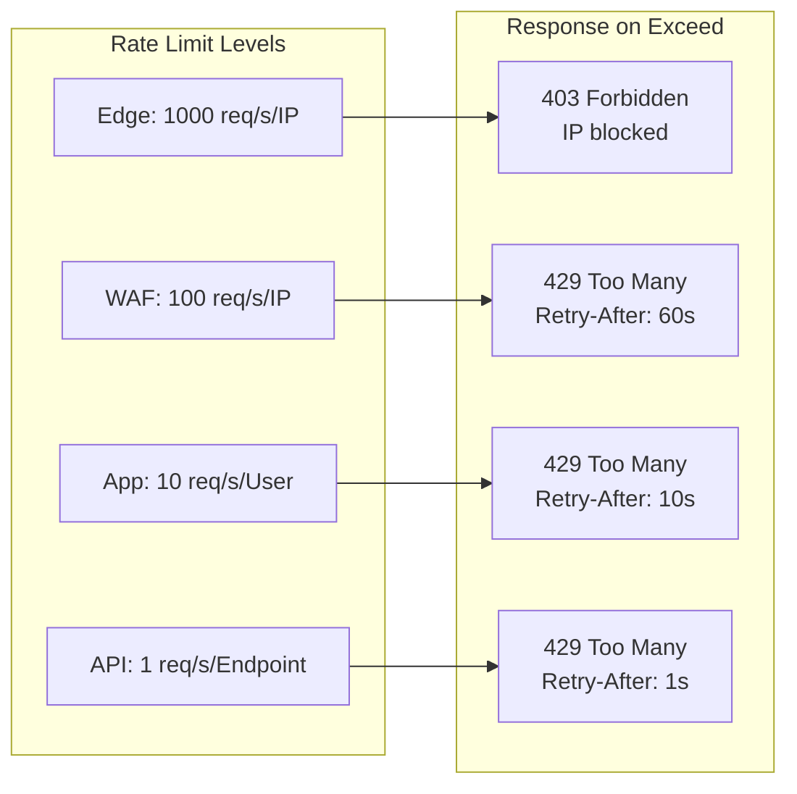
```mermaid
flowchart LR
    subgraph Levels["Rate Limit Levels"]
        L1["Edge: 1000 req/s/IP"]
        L2["WAF: 100 req/s/IP"]
        L3["App: 10 req/s/User"]
        L4["API: 1 req/s/Endpoint"]
    end

    subgraph Response["Response on Exceed"]
        R1["403 Forbidden<br/>IP blocked"]
        R2["429 Too Many<br/>Retry-After: 60s"]
        R3["429 Too Many<br/>Retry-After: 10s"]
        R4["429 Too Many<br/>Retry-After: 1s"]
    end

    L1 --> R1
    L2 --> R2
    L3 --> R3
    L4 --> R4
```

---

## Scenario 5: Datacenter Outage

**Situation:** The entire Frankfurt datacenter goes down (power failure, natural disaster).

### Multi-Region Failover

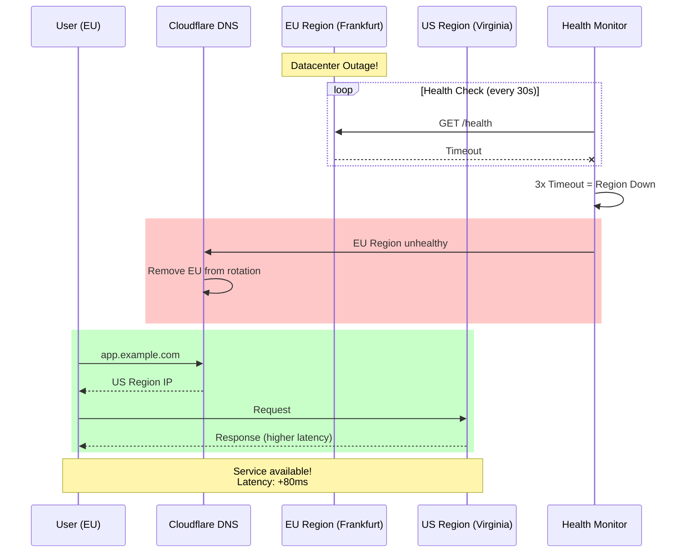
```mermaid
sequenceDiagram
    participant User as User (EU)
    participant DNS as Cloudflare DNS
    participant EU as EU Region (Frankfurt)
    participant US as US Region (Virginia)
    participant Monitor as Health Monitor

    Note over EU: Datacenter Outage!

    loop Health Check (every 30s)
        Monitor->>EU: GET /health
        EU--xMonitor: Timeout
    end

    Monitor->>Monitor: 3x Timeout = Region Down

    rect rgb(255, 200, 200)
        Monitor->>DNS: EU Region unhealthy
        DNS->>DNS: Remove EU from rotation
    end

    rect rgb(200, 255, 200)
        User->>DNS: app.example.com
        DNS-->>User: US Region IP
        User->>US: Request
        US-->>User: Response (higher latency)
    end

    Note over User,US: Service available!<br/>Latency: +80ms
```

### GeoDNS Failover

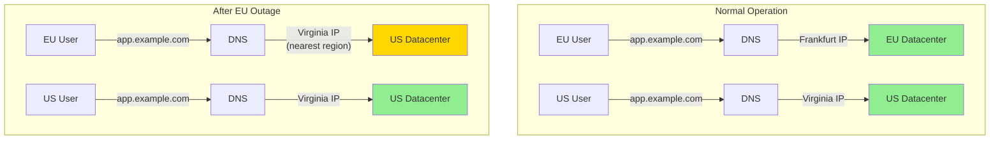
```mermaid
flowchart TB
    subgraph Normal["Normal Operation"]
        EU_User[EU User] -->|"app.example.com"| DNS1[DNS]
        DNS1 -->|"Frankfurt IP"| EU_DC[EU Datacenter]

        US_User[US User] -->|"app.example.com"| DNS2[DNS]
        DNS2 -->|"Virginia IP"| US_DC[US Datacenter]
    end

    subgraph Failover["After EU Outage"]
        EU_User2[EU User] -->|"app.example.com"| DNS3[DNS]
        DNS3 -->|"Virginia IP<br/>(nearest region)"| US_DC2[US Datacenter]

        US_User2[US User] -->|"app.example.com"| DNS4[DNS]
        DNS4 -->|"Virginia IP"| US_DC3[US Datacenter]
    end

    style EU_DC fill:#90EE90
    style US_DC fill:#90EE90
    style US_DC2 fill:#FFD700
    style US_DC3 fill:#90EE90
```

### Data Synchronization Between Regions

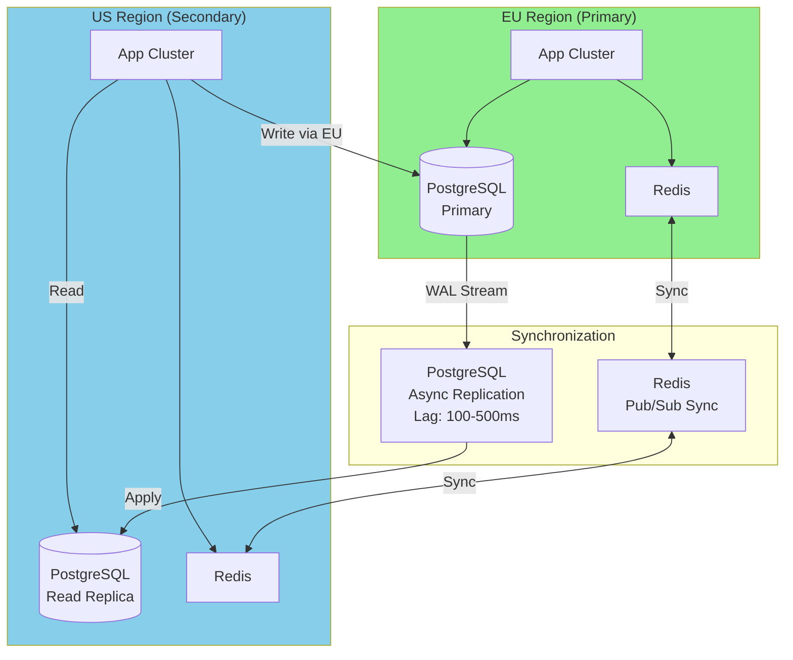
```mermaid
flowchart TB
    subgraph EU["EU Region (Primary)"]
        EU_App[App Cluster]
        EU_DB[(PostgreSQL<br/>Primary)]
        EU_Redis[Redis]
    end

    subgraph US["US Region (Secondary)"]
        US_App[App Cluster]
        US_DB[(PostgreSQL<br/>Read Replica)]
        US_Redis[Redis]
    end

    subgraph Sync["Synchronization"]
        DBSync[PostgreSQL<br/>Async Replication<br/>Lag: 100-500ms]
        CacheSync[Redis<br/>Pub/Sub Sync]
    end

    EU_DB -->|WAL Stream| DBSync -->|Apply| US_DB
    EU_Redis <-->|Sync| CacheSync <-->|Sync| US_Redis

    EU_App --> EU_DB
    EU_App --> EU_Redis

    US_App -->|Read| US_DB
    US_App -->|Write via EU| EU_DB
    US_App --> US_Redis

    style EU fill:#90EE90
    style US fill:#87CEEB
```

---

## Scenario 6: Data Corruption by Bug

**Situation:** A bug in the code accidentally deletes user data.

### Point-in-Time Recovery

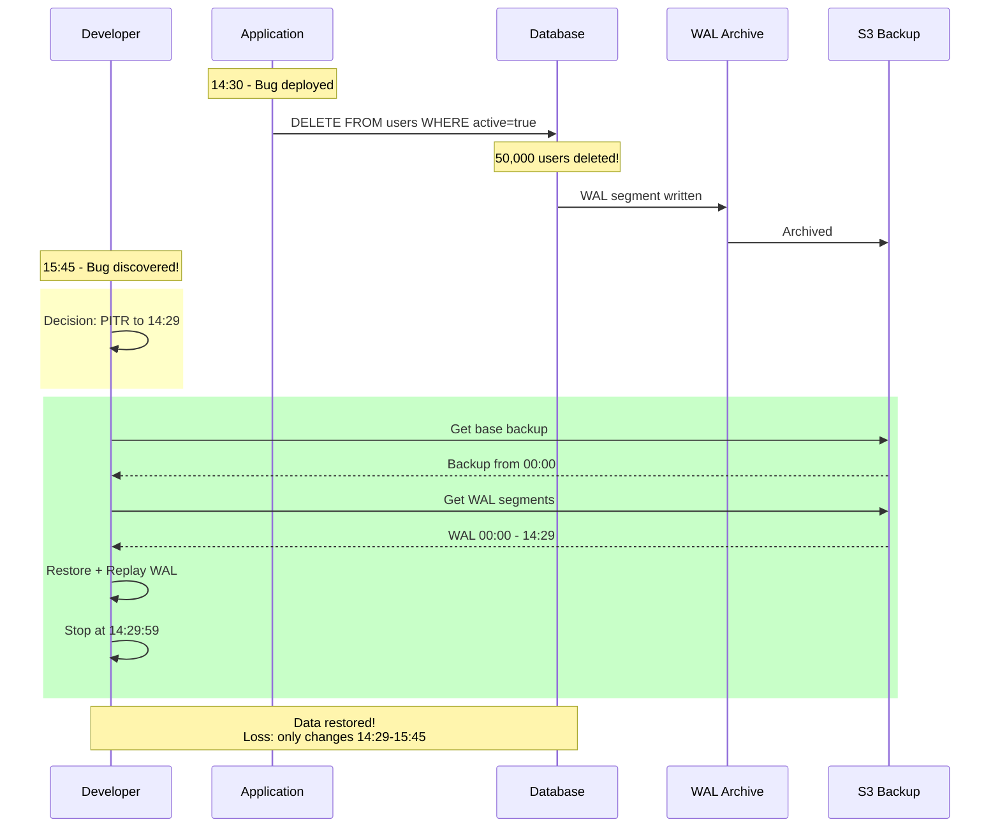
```mermaid
sequenceDiagram
    participant Dev as Developer
    participant App as Application
    participant DB as Database
    participant WAL as WAL Archive
    participant S3 as S3 Backup

    Note over App: 14:30 - Bug deployed
    App->>DB: DELETE FROM users WHERE active=true
    Note over DB: 50,000 users deleted!

    DB->>WAL: WAL segment written
    WAL->>S3: Archived

    Note over Dev: 15:45 - Bug discovered!

    rect rgb(255, 255, 200)
        Dev->>Dev: Decision: PITR to 14:29
    end

    rect rgb(200, 255, 200)
        Dev->>S3: Get base backup
        S3-->>Dev: Backup from 00:00
        Dev->>S3: Get WAL segments
        S3-->>Dev: WAL 00:00 - 14:29

        Dev->>Dev: Restore + Replay WAL
        Dev->>Dev: Stop at 14:29:59
    end

    Note over Dev,DB: Data restored!<br/>Loss: only changes 14:29-15:45
```

### Recovery Options

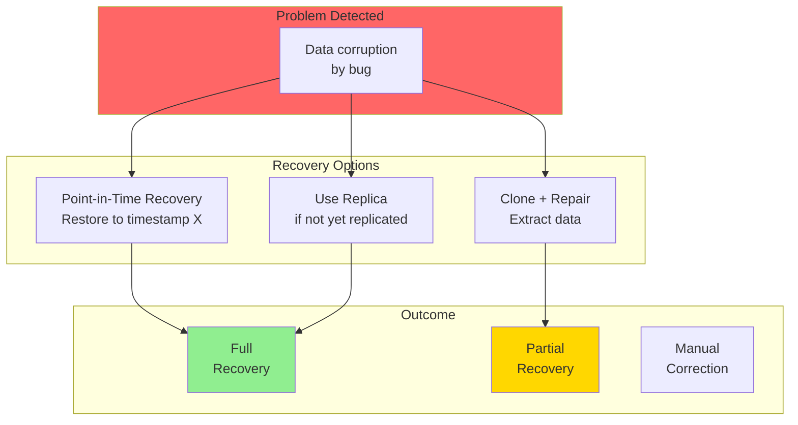
```mermaid
flowchart TB
    subgraph Problem["Problem Detected"]
        Bug[Data corruption<br/>by bug]
    end

    subgraph Options["Recovery Options"]
        PITR[Point-in-Time Recovery<br/>Restore to timestamp X]
        Clone[Clone + Repair<br/>Extract data]
        Replica[Use Replica<br/>if not yet replicated]
    end

    subgraph Outcome["Outcome"]
        Full[Full<br/>Recovery]
        Partial[Partial<br/>Recovery]
        Manual[Manual<br/>Correction]
    end

    Bug --> PITR & Clone & Replica
    PITR --> Full
    Clone --> Partial
    Replica --> Full

    style Problem fill:#ff6666
    style Full fill:#90EE90
    style Partial fill:#FFD700
```

---

## Scenario 7: Memory Leak / OOM

**Situation:** A memory leak causes the backend pod to be OOM (Out of Memory) killed.

### Kubernetes Self-Healing

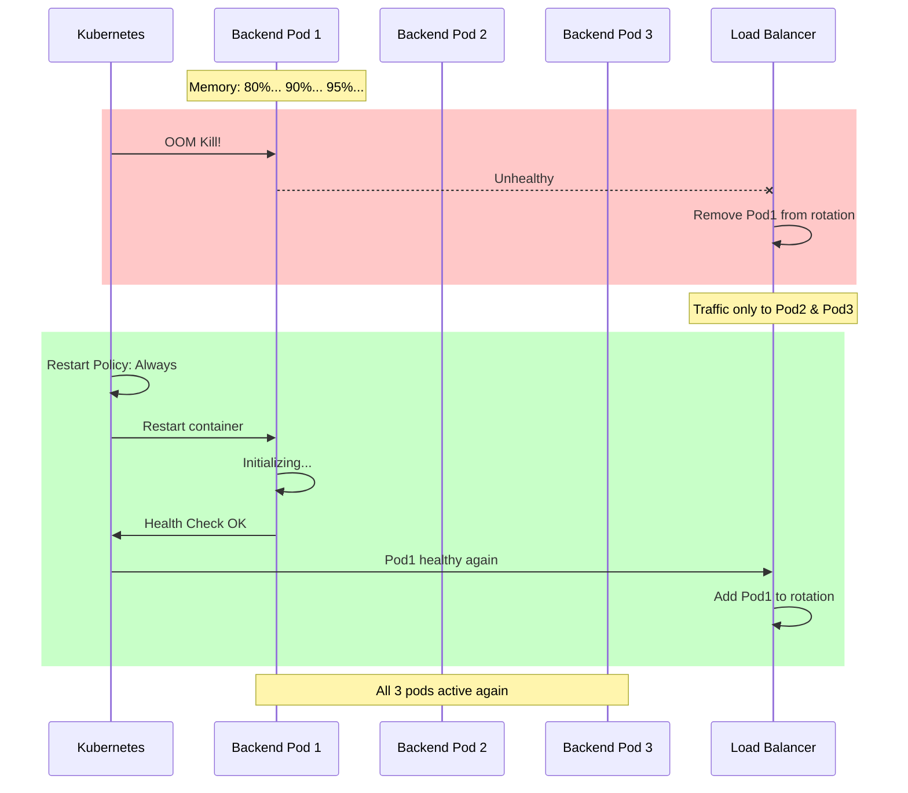
```mermaid
sequenceDiagram
    participant K8s as Kubernetes
    participant Pod1 as Backend Pod 1
    participant Pod2 as Backend Pod 2
    participant Pod3 as Backend Pod 3
    participant LB as Load Balancer

    Note over Pod1: Memory: 80%... 90%... 95%...

    rect rgb(255, 200, 200)
        K8s->>Pod1: OOM Kill!
        Pod1--xLB: Unhealthy
        LB->>LB: Remove Pod1 from rotation
    end

    Note over LB: Traffic only to Pod2 & Pod3

    rect rgb(200, 255, 200)
        K8s->>K8s: Restart Policy: Always
        K8s->>Pod1: Restart container
        Pod1->>Pod1: Initializing...
        Pod1->>K8s: Health Check OK
        K8s->>LB: Pod1 healthy again
        LB->>LB: Add Pod1 to rotation
    end

    Note over Pod1,Pod3: All 3 pods active again
```

### Resource Limits & Monitoring

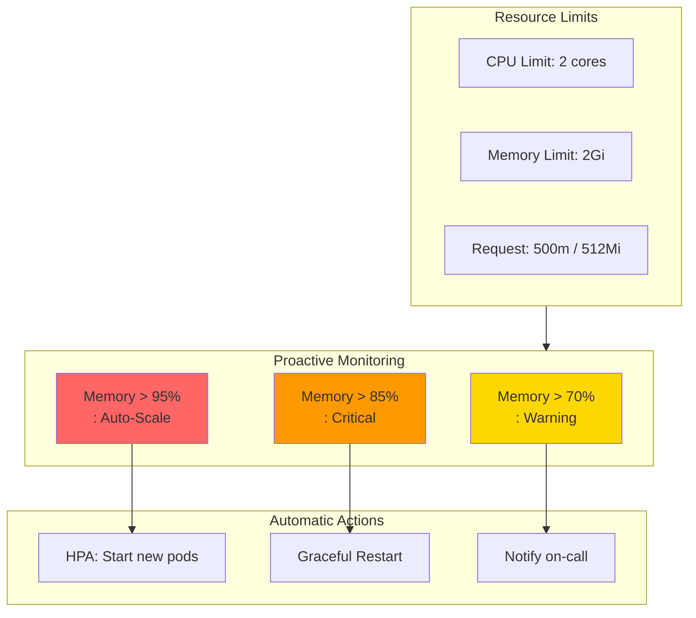
```mermaid
flowchart TB
    subgraph Limits["Resource Limits"]
        CPU["CPU Limit: 2 cores"]
        Mem["Memory Limit: 2Gi"]
        Req["Request: 500m / 512Mi"]
    end

    subgraph Monitoring["Proactive Monitoring"]
        Alert1["Memory > 70%<br/>: Warning"]
        Alert2["Memory > 85%<br/>: Critical"]
        Alert3["Memory > 95%<br/>: Auto-Scale"]
    end

    subgraph Actions["Automatic Actions"]
        Scale[HPA: Start new pods]
        Restart[Graceful Restart]
        Page[Notify on-call]
    end

    Limits --> Monitoring
    Alert1 --> Page
    Alert2 --> Restart
    Alert3 --> Scale

    style Alert1 fill:#FFD700
    style Alert2 fill:#FF9900
    style Alert3 fill:#ff6666
```

---

## Scenario 8: SSL Certificate Expires

**Situation:** The SSL certificate expires in 7 days.

### Automatic Certificate Renewal

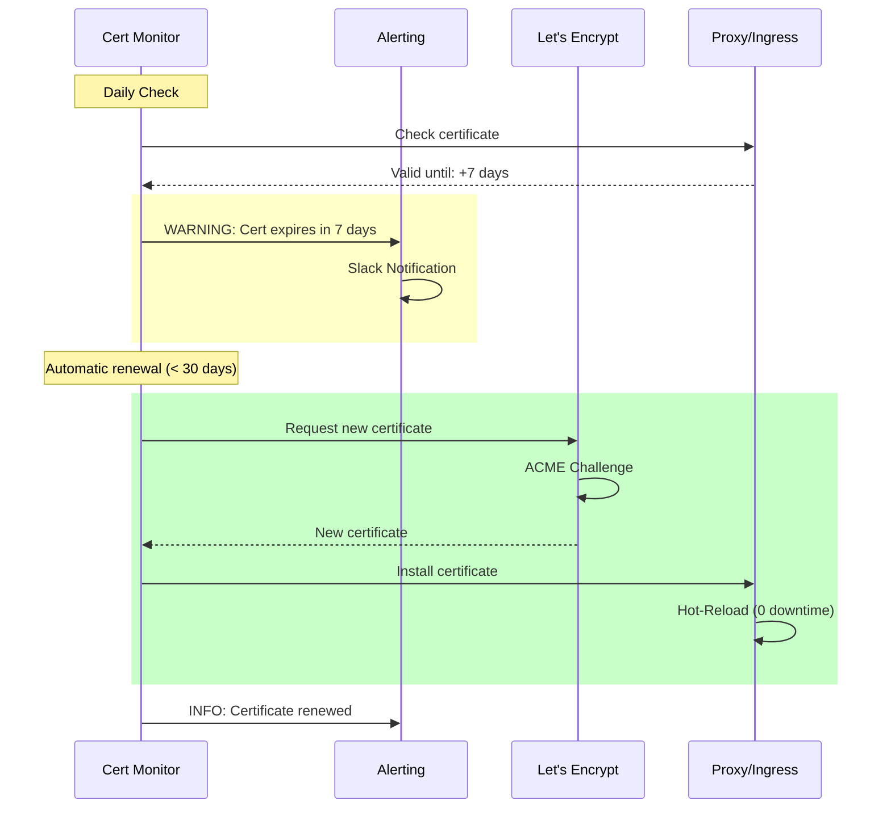
```mermaid
sequenceDiagram
    participant Monitor as Cert Monitor
    participant Alert as Alerting
    participant LE as Let's Encrypt
    participant Proxy as Proxy/Ingress

    Note over Monitor: Daily Check

    Monitor->>Proxy: Check certificate
    Proxy-->>Monitor: Valid until: +7 days

    rect rgb(255, 255, 200)
        Monitor->>Alert: WARNING: Cert expires in 7 days
        Alert->>Alert: Slack Notification
    end

    Note over Monitor: Automatic renewal (< 30 days)

    rect rgb(200, 255, 200)
        Monitor->>LE: Request new certificate
        LE->>LE: ACME Challenge
        LE-->>Monitor: New certificate
        Monitor->>Proxy: Install certificate
        Proxy->>Proxy: Hot-Reload (0 downtime)
    end

    Monitor->>Alert: INFO: Certificate renewed
```

### Certificate Monitoring Dashboard

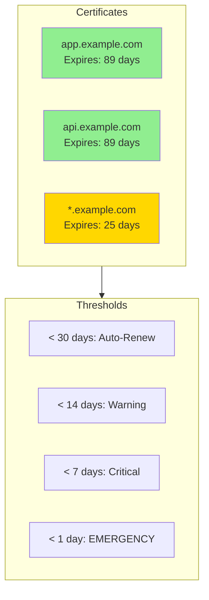
```mermaid
flowchart TB
    subgraph Certs["Certificates"]
        Main["app.example.com<br/>Expires: 89 days"]
        API["api.example.com<br/>Expires: 89 days"]
        Wild["*.example.com<br/>Expires: 25 days"]
    end

    subgraph Thresholds["Thresholds"]
        T1["< 30 days: Auto-Renew"]
        T2["< 14 days: Warning"]
        T3["< 7 days: Critical"]
        T4["< 1 day: EMERGENCY"]
    end

    Certs --> Thresholds

    style Main fill:#90EE90
    style API fill:#90EE90
    style Wild fill:#FFD700
```

---

## Summary: Protection Matrix

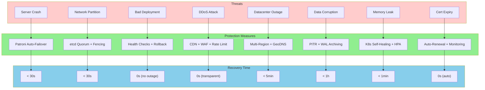
```mermaid
flowchart TB
    subgraph Threats["Threats"]
        T1[Server Crash]
        T2[Network Partition]
        T3[Bad Deployment]
        T4[DDoS Attack]
        T5[Datacenter Outage]
        T6[Data Corruption]
        T7[Memory Leak]
        T8[Cert Expiry]
    end

    subgraph Protection["Protection Measures"]
        P1[Patroni Auto-Failover]
        P2[etcd Quorum + Fencing]
        P3[Health Checks + Rollback]
        P4[CDN + WAF + Rate Limit]
        P5[Multi-Region + GeoDNS]
        P6[PITR + WAL Archiving]
        P7[K8s Self-Healing + HPA]
        P8[Auto-Renewal + Monitoring]
    end

    subgraph Recovery["Recovery Time"]
        R1["< 30s"]
        R2["< 30s"]
        R3["0s (no outage)"]
        R4["0s (transparent)"]
        R5["< 5min"]
        R6["< 1h"]
        R7["< 1min"]
        R8["0s (auto)"]
    end

    T1 --> P1 --> R1
    T2 --> P2 --> R2
    T3 --> P3 --> R3
    T4 --> P4 --> R4
    T5 --> P5 --> R5
    T6 --> P6 --> R6
    T7 --> P7 --> R7
    T8 --> P8 --> R8

    style Threats fill:#ffcccc
    style Protection fill:#90EE90
    style Recovery fill:#87CEEB
```

| Scenario | Protection | Recovery | Data Loss |
|----------|------------|----------|-----------|
| Server Crash | Patroni Failover | < 30s | 0 |
| Network Partition | etcd Quorum | < 30s | 0 |
| Bad Deployment | Health Checks | 0s | 0 |
| DDoS Attack | CDN + WAF | 0s | 0 |
| Datacenter Outage | Multi-Region | < 5min | < 500ms lag |
| Data Corruption | PITR | < 1h | Until bug |
| Memory Leak | K8s Self-Healing | < 1min | 0 |
| Cert Expiry | Auto-Renewal | 0s | 0 |
