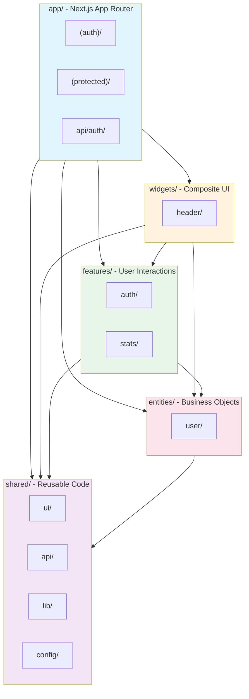
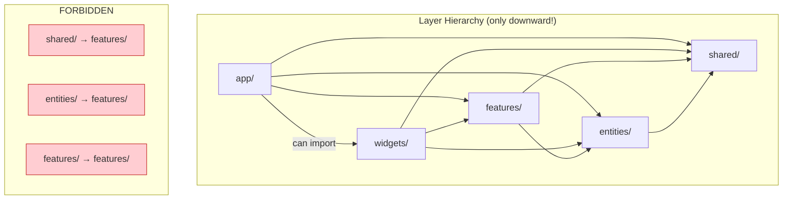
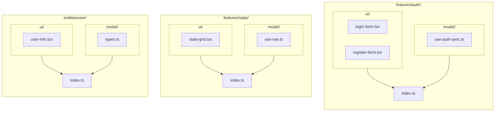
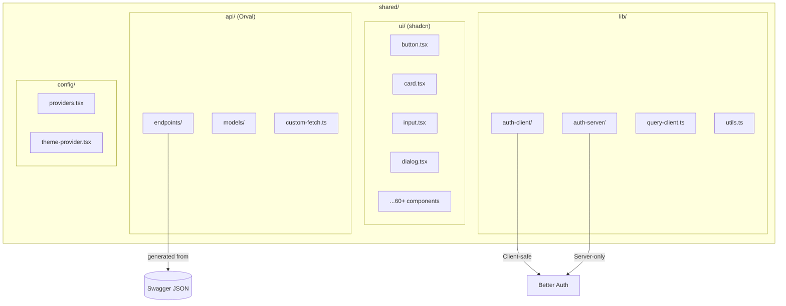
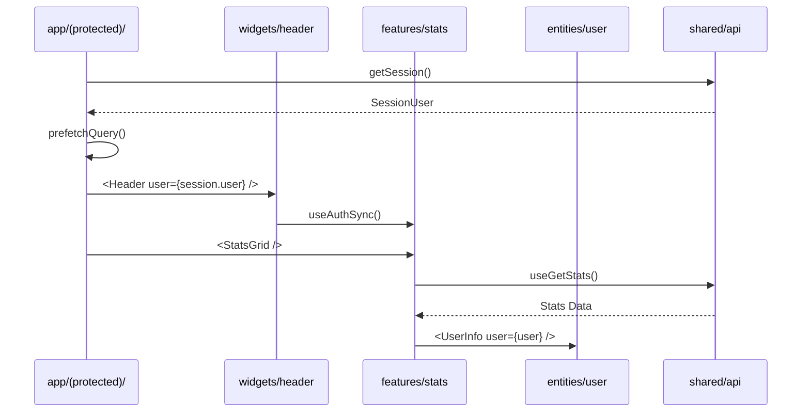
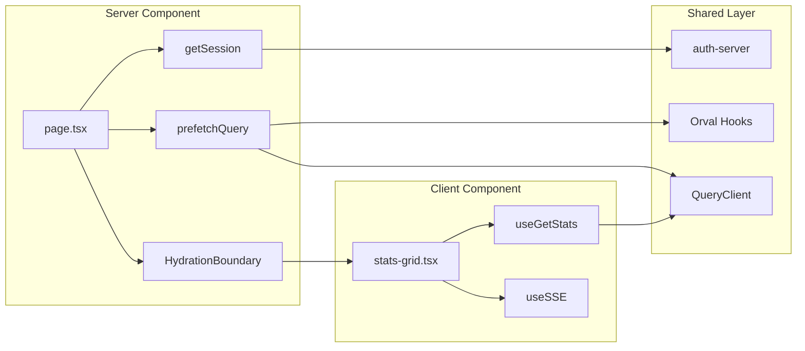
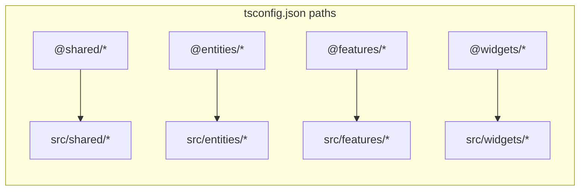
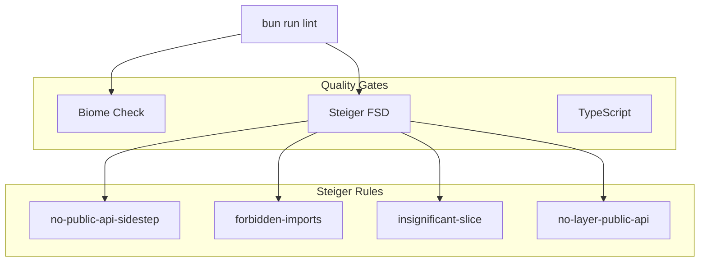

# Frontend Architecture - Feature-Sliced Design (C4 Level 3)

## Architecture Overview

The frontend uses **Feature-Sliced Design (FSD)** - an architectural methodology for scalable frontend applications.

## FSD Layer Diagram



## Import Rules (Dependency Flow)



## Slice Structure (Component Diagram)



## Shared Layer Details



## Data Flow Diagram



## Request/Response Flow



## TypeScript Path Aliases



## Linting Architecture



## Comparison: Before vs. After FSD

### Before (Flat Structure)

```
src/
├── api/                # Mixed concerns
├── components/
│   ├── ui/            # shadcn
│   ├── header.tsx     # App-specific
│   ├── providers.tsx  # Config
│   └── ...
├── hooks/             # All hooks mixed
└── lib/               # All utilities mixed
```

### After (FSD)

```
src/
├── widgets/header/     # Composite, uses features
├── features/
│   ├── auth/          # Login, Register, Sync
│   └── stats/         # Stats, SSE
├── entities/user/      # User types, display
└── shared/
    ├── ui/            # shadcn (no business logic)
    ├── api/           # Orval (generated)
    ├── lib/           # Utilities
    └── config/        # App config
```

## Benefits of FSD Architecture

| Aspect | Description |
|--------|-------------|
| **Scalability** | New features = new slices, no changes to existing code |
| **Isolation** | Features are independent, no cross-imports |
| **Discoverability** | Clear structure, easy onboarding |
| **Testability** | Slices can be tested in isolation |
| **Refactoring** | Change one slice without affecting others |
| **Linting** | Automatic architecture rule validation |
