# High Availability Architecture

Enterprise-grade fault tolerance following the patterns of Notion, Spotify, Shopify.

## Executive Summary

This document describes the evolution from single-server to a highly available, globally distributed architecture.

---

## Phase 1: Current State (Single Server)

Current state of the infrastructure.

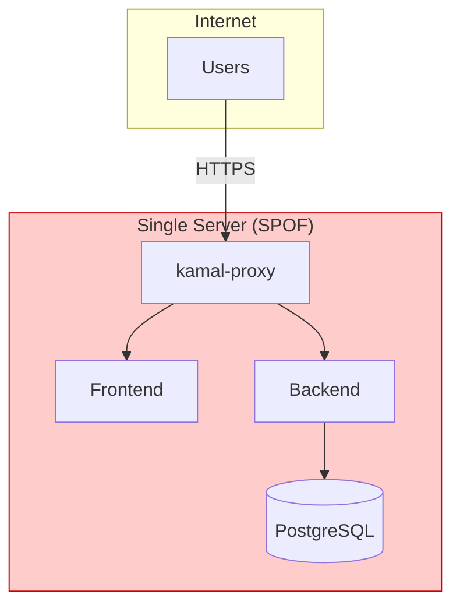

**Problems:**

- Single Point of Failure (SPOF)
- No horizontal scaling
- Possible downtime during deployments
- No geographic redundancy

---

## Phase 2: Regional High Availability

First level of fault tolerance - everything in one region, but redundant.

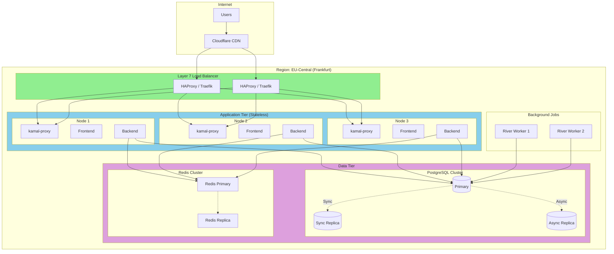

### Component Details

| Component | Replicas | Strategy | Failover Time |
|-----------|----------|----------|---------------|
| Load Balancer | 2 | Active-Passive | < 10s |
| App Nodes | 3+ | Active-Active | 0s (instant) |
| PostgreSQL | 3 | Primary + Replicas | < 30s |
| Redis | 2 | Primary + Replica | < 5s |
| River Workers | 2+ | Competing Consumers | 0s |

---

## Phase 3: Multi-Region Active-Active

Global availability like Notion/Shopify.

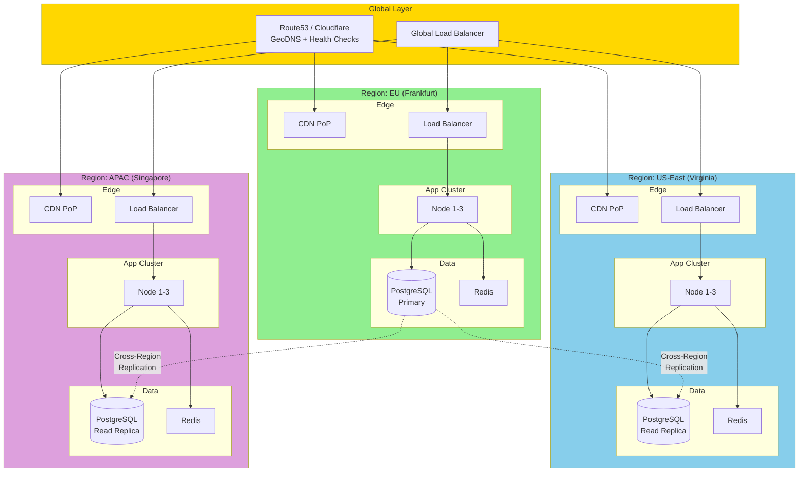

---

## Database Tier: PostgreSQL High Availability (Deep Dive)

This is the most critical component - the single source of truth lives here.

### Why is the Database so Critical?

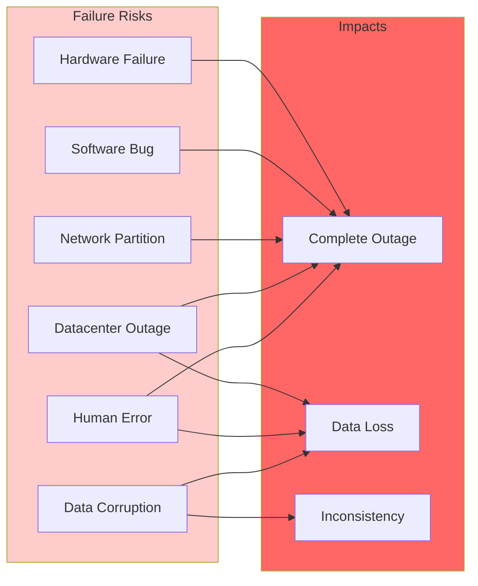

### PostgreSQL HA Architecture with Patroni

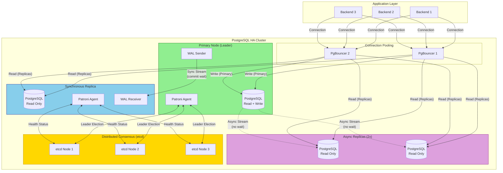

### Replication Modes Explained

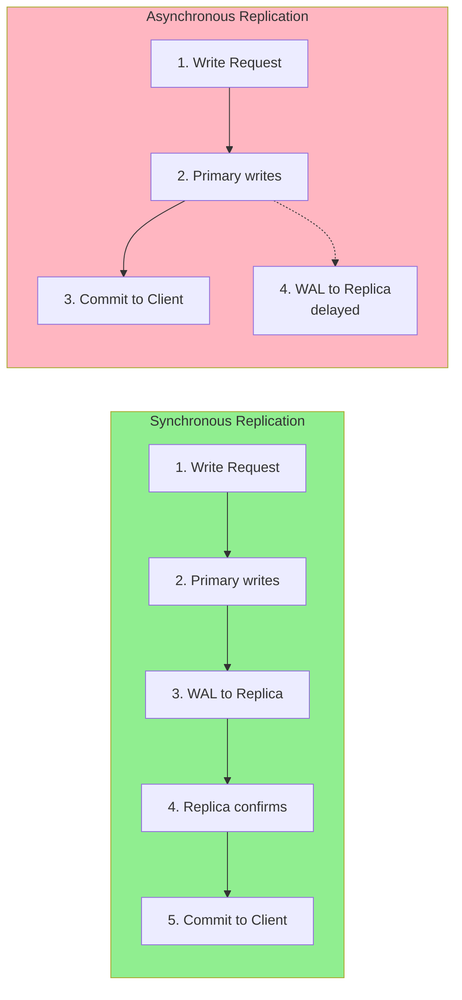

| Mode | Data Loss | Latency | Use Case |
|------|-----------|---------|----------|
| **Synchronous** | 0 (guaranteed) | +2-5ms | Financial data, critical writes |
| **Asynchronous** | Possible (< 1s) | Minimal | Read replicas, analytics |

### Failover Scenario: Primary Goes Down

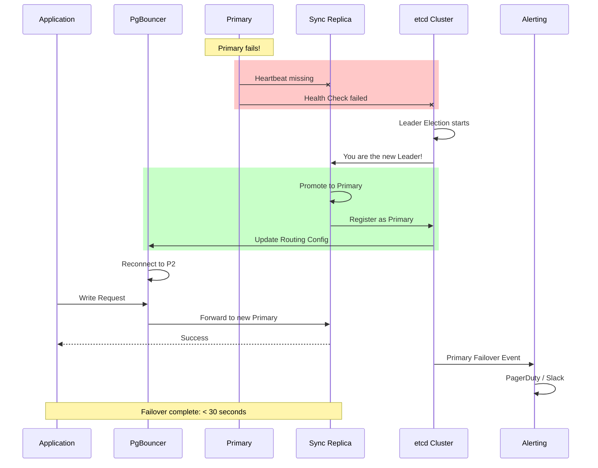

### Failover Scenarios in Detail

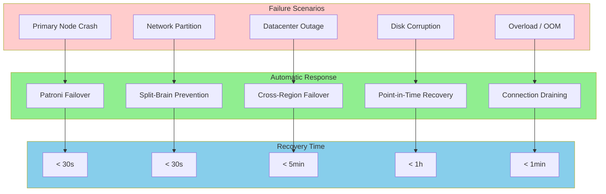

### Split-Brain Prevention

The most dangerous scenario: Two nodes believe they are Primary.

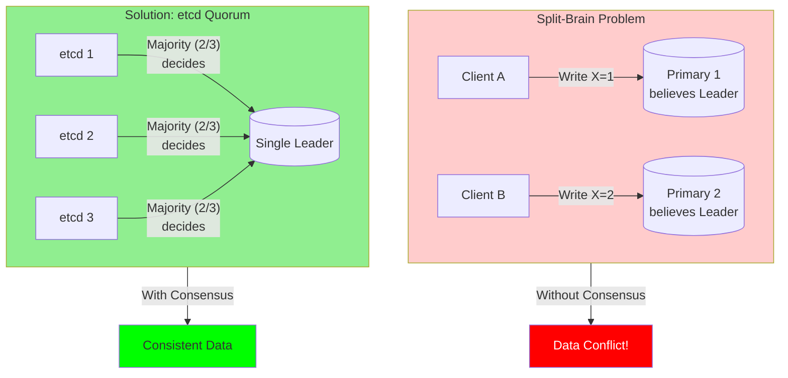

### Connection Pooling with PgBouncer

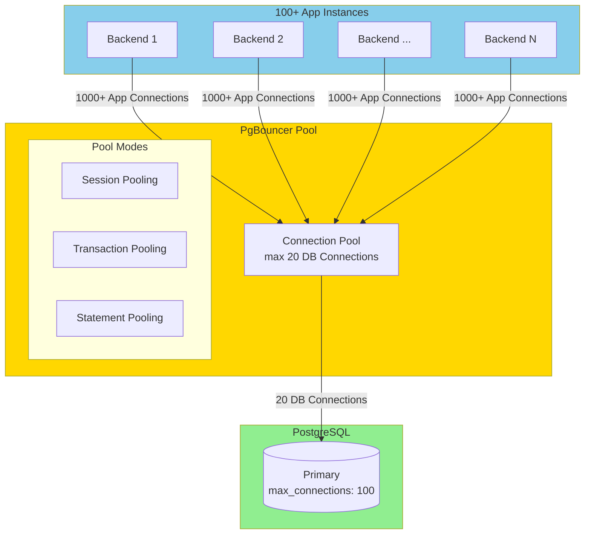

| Pool Mode | Description | Use Case |
|-----------|-------------|----------|
| **Session** | Conn stays with client | Prepared Statements, Temp Tables |
| **Transaction** | Conn per transaction | Standard OLTP (recommended) |
| **Statement** | Conn per query | Simple queries only |

### Backup & Point-in-Time Recovery

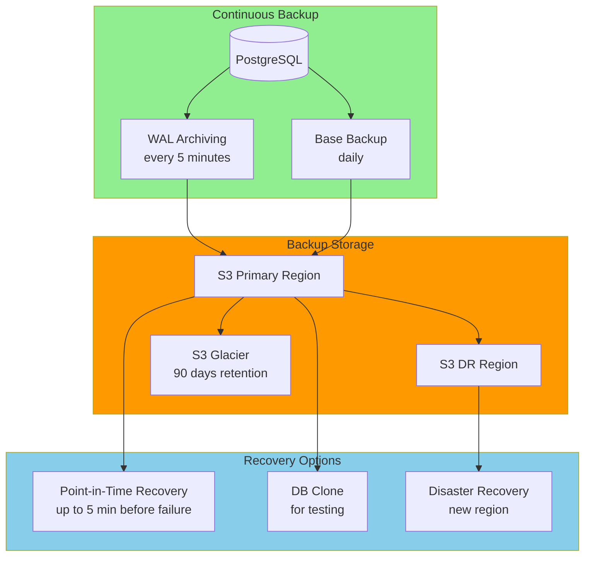

### RPO & RTO Targets

| Tier | RPO (max. data loss) | RTO (max. downtime) | Strategy |
|------|----------------------|---------------------|----------|
| **Enterprise** | 0 (zero loss) | < 1 min | Multi-Region Active-Active |
| **Business Critical** | < 1 min | < 15 min | Hot Standby + Auto-Failover |
| **Standard** | < 1 hour | < 4 hours | Warm Standby |
| **Archive** | < 24 hours | < 24 hours | Cold Backup |

### Database Monitoring

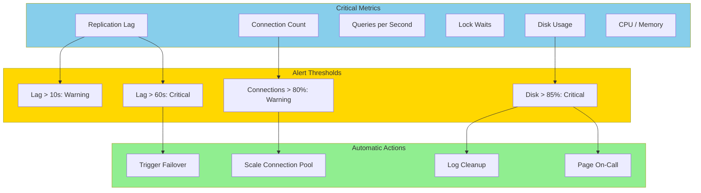

---

## Caching Layer (Redis)

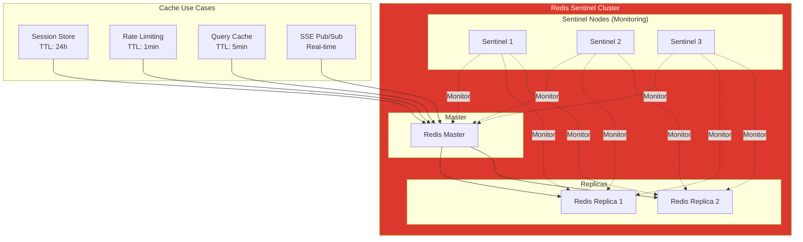

---

## Disaster Recovery

### Backup Strategy

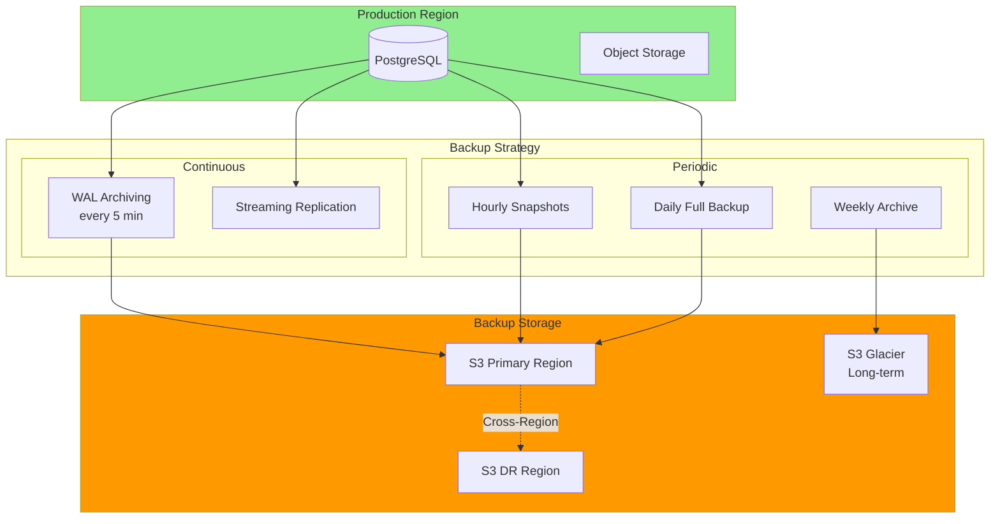

---

## Monitoring & Observability

### Observability Stack

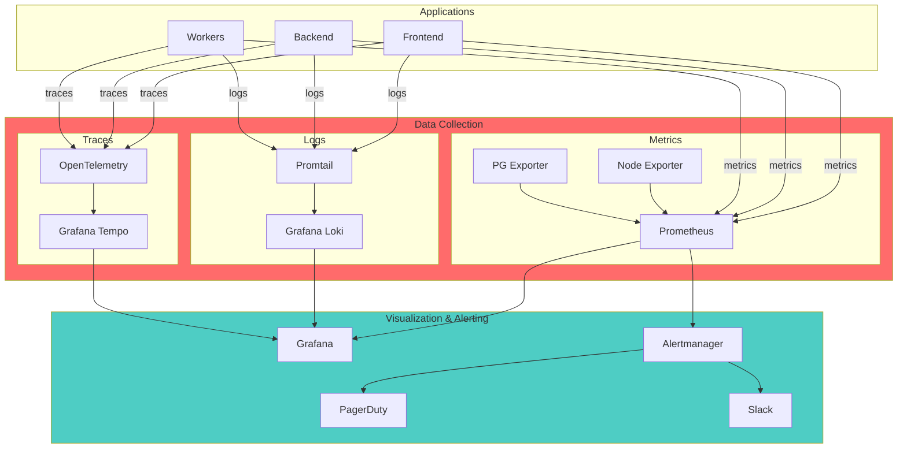

---

## Security in HA Environment

### Zero Trust Architecture

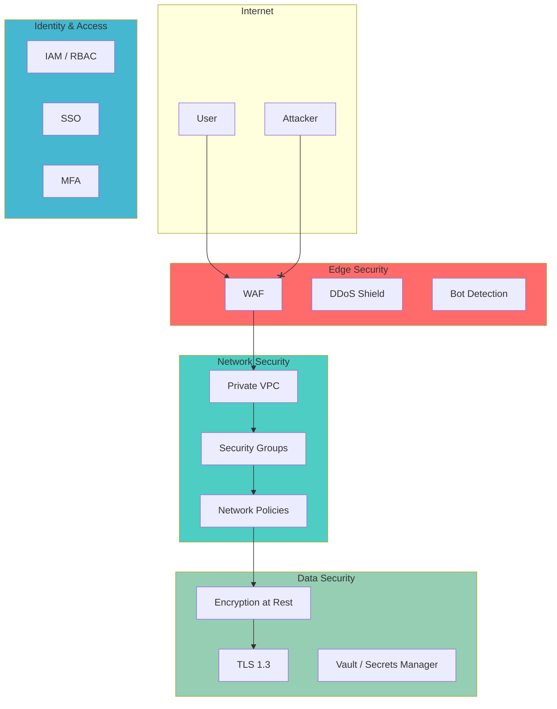

---

## Migration Path

### From Current State to HA

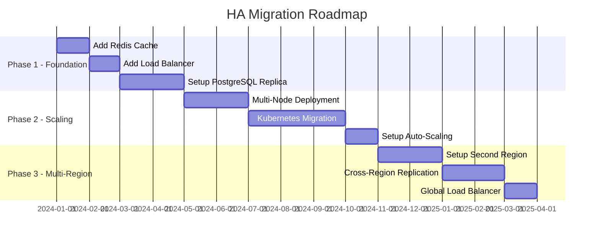

### Cost Overview

| Phase | Description | Cost/Month |
|-------|-------------|------------|
| Current | Single Server | ~15 EUR |
| Phase 1 | Regional HA (Basic) | ~150 EUR |
| Phase 2 | Regional HA (Full) | ~800 EUR |
| Phase 3 | Multi-Region (2) | ~2500 EUR |
| Phase 4 | Multi-Region (3) | ~4500 EUR |

---

## Decision Matrix: Build vs Buy

| Component | Recommendation | Reason |
|-----------|----------------|--------|
| **Load Balancing** | Buy (Cloudflare/AWS) | Commodity, cheap |
| **Database HA** | Managed (RDS/Cloud SQL) | Critical, complex |
| **Monitoring** | SaaS (Grafana Cloud) | Focus on core business |
| **CDN** | Buy (Cloudflare) | Global PoPs needed |
| **Auth** | Build (Better Auth) | Already implemented |
| **Kubernetes** | Managed (EKS/GKE) | Operational overhead |

---

## Summary

### Key Takeaways

1. **Stateless Application Layer** - Horizontal scaling through stateless design
2. **Database as Single Source of Truth** - PostgreSQL with HA cluster is critical
3. **Caching for Performance** - Redis for sessions and frequent queries
4. **Event-Driven Architecture** - River for jobs, optionally Kafka for events
5. **Defense in Depth** - Multiple security layers
6. **Observability First** - Metrics, logs, traces from the start

### Next Steps

1. [ ] Introduce Redis Cache (Sessions, Rate Limiting)
2. [ ] Setup PostgreSQL Replica
3. [ ] Add Load Balancer in front of App Server
4. [ ] Evaluate Kubernetes Migration
5. [ ] Document Disaster Recovery Plan
