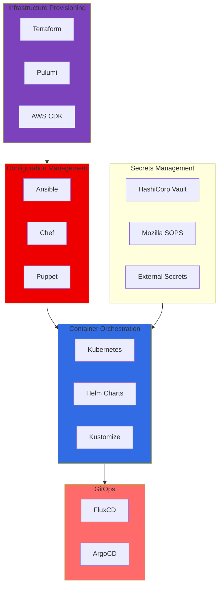
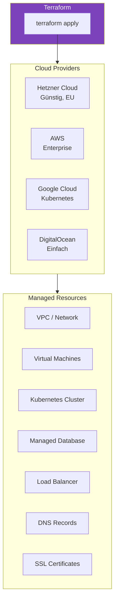
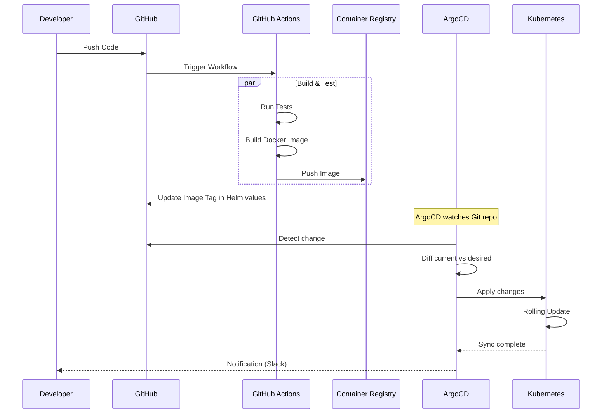
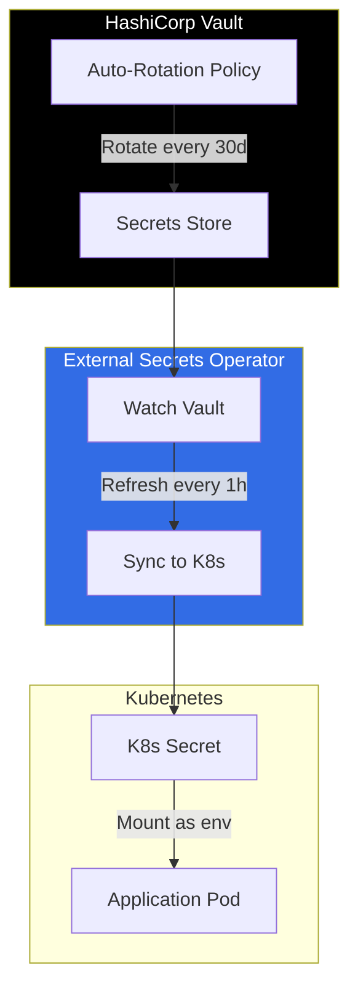
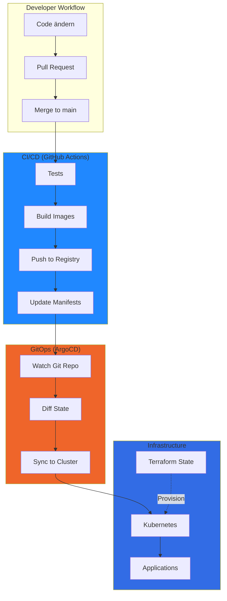

# Infrastructure as Code (IaC)

Vollständige Automatisierung der HA-Architektur mit Terraform, Pulumi, Ansible und Kubernetes.

---

## Übersicht: IaC Tool-Landschaft



### Empfohlener Stack für Next-Go-PG

| Layer | Tool | Grund |
|-------|------|-------|
| **Cloud Infrastructure** | Terraform | Industry Standard, Multi-Cloud |
| **Kubernetes** | Helm + Kustomize | Flexibel, gut dokumentiert |
| **GitOps** | ArgoCD | Kubernetes-native, UI |
| **Secrets** | External Secrets + Vault | Sicher, automatisiert |
| **CI/CD** | GitHub Actions | Schon im Projekt integriert |

---

## Projektstruktur

```
infrastructure/
├── terraform/
│   ├── environments/
│   │   ├── dev/
│   │   │   ├── main.tf
│   │   │   ├── variables.tf
│   │   │   └── terraform.tfvars
│   │   ├── staging/
│   │   └── production/
│   ├── modules/
│   │   ├── networking/
│   │   ├── kubernetes/
│   │   ├── database/
│   │   ├── redis/
│   │   ├── monitoring/
│   │   └── cdn/
│   └── shared/
│       ├── providers.tf
│       └── backend.tf
│
├── kubernetes/
│   ├── base/
│   │   ├── namespace.yaml
│   │   ├── backend/
│   │   ├── frontend/
│   │   ├── river-worker/
│   │   └── monitoring/
│   ├── overlays/
│   │   ├── dev/
│   │   ├── staging/
│   │   └── production/
│   └── helm/
│       ├── next-go-pg/
│       └── values/
│
├── argocd/
│   ├── applications/
│   ├── applicationsets/
│   └── projects/
│
└── scripts/
    ├── bootstrap.sh
    ├── destroy.sh
    └── rotate-secrets.sh
```

---

## Phase 1: Cloud Infrastructure mit Terraform

### Provider-Übersicht



### Terraform Module: Kubernetes Cluster

```hcl
# infrastructure/terraform/modules/kubernetes/main.tf

variable "environment" {
  type = string
}

variable "region" {
  type    = string
  default = "eu-central-1"
}

variable "node_count" {
  type    = number
  default = 3
}

variable "node_type" {
  type    = string
  default = "cx31" # Hetzner: 2 vCPU, 8GB RAM
}

# Hetzner Kubernetes Cluster
resource "hcloud_kubernetes_cluster" "main" {
  name     = "next-go-pg-${var.environment}"
  location = var.region

  node_pool {
    name       = "worker"
    node_count = var.node_count
    node_type  = var.node_type

    labels = {
      environment = var.environment
      managed_by  = "terraform"
    }
  }

  # Auto-Upgrade für Security Patches
  auto_upgrade {
    enabled = true
    window  = "Sun 03:00"
  }
}

# Load Balancer
resource "hcloud_load_balancer" "ingress" {
  name               = "ingress-${var.environment}"
  load_balancer_type = "lb11"
  location           = var.region

  algorithm {
    type = "round_robin"
  }
}

# Outputs für andere Module
output "cluster_endpoint" {
  value = hcloud_kubernetes_cluster.main.endpoint
}

output "kubeconfig" {
  value     = hcloud_kubernetes_cluster.main.kubeconfig
  sensitive = true
}
```

### Terraform Module: PostgreSQL HA

```hcl
# infrastructure/terraform/modules/database/main.tf

variable "environment" {
  type = string
}

variable "ha_enabled" {
  type    = bool
  default = true
}

# Managed PostgreSQL mit HA
resource "hcloud_managed_database" "postgres" {
  name     = "postgres-${var.environment}"
  type     = "postgres"
  version  = "16"
  location = var.region

  # HA Konfiguration
  plan = var.ha_enabled ? "ha-2" : "basic-1"

  maintenance_window {
    day  = "sunday"
    hour = 3
  }

  # Automatische Backups
  backup {
    enabled   = true
    retention = 7 # Tage
    time      = "02:00"
  }
}

# Connection Pooler (PgBouncer)
resource "hcloud_managed_database_connection_pool" "pool" {
  database_id = hcloud_managed_database.postgres.id
  name        = "pgbouncer"
  mode        = "transaction"
  size        = 25
}

# Firewall: Nur Kubernetes Cluster Zugriff
resource "hcloud_firewall" "database" {
  name = "database-${var.environment}"

  rule {
    direction  = "in"
    protocol   = "tcp"
    port       = "5432"
    source_ips = [hcloud_kubernetes_cluster.main.network_cidr]
  }
}

output "connection_string" {
  value     = hcloud_managed_database.postgres.connection_string
  sensitive = true
}

output "pooler_connection_string" {
  value     = hcloud_managed_database_connection_pool.pool.connection_string
  sensitive = true
}
```

### Terraform Module: Redis Cluster

```hcl
# infrastructure/terraform/modules/redis/main.tf

variable "environment" {
  type = string
}

variable "ha_enabled" {
  type    = bool
  default = true
}

# Managed Redis mit Sentinel
resource "hcloud_managed_database" "redis" {
  name     = "redis-${var.environment}"
  type     = "redis"
  version  = "7"
  location = var.region

  plan = var.ha_enabled ? "ha-2" : "basic-1"

  # Redis-spezifische Konfiguration
  config {
    maxmemory_policy = "allkeys-lru"
  }
}

output "redis_url" {
  value     = hcloud_managed_database.redis.connection_string
  sensitive = true
}
```

### Terraform: Multi-Region Setup

```hcl
# infrastructure/terraform/environments/production/main.tf

module "eu_region" {
  source = "../../modules/kubernetes"

  environment = "production"
  region      = "eu-central"
  node_count  = 3
  node_type   = "cx41"
}

module "us_region" {
  source = "../../modules/kubernetes"

  environment = "production"
  region      = "us-east"
  node_count  = 3
  node_type   = "cx41"
}

# Global Load Balancer (Cloudflare)
resource "cloudflare_load_balancer" "global" {
  zone_id     = var.cloudflare_zone_id
  name        = "app.example.com"
  description = "Global Load Balancer"

  default_pool_ids = [
    cloudflare_load_balancer_pool.eu.id,
    cloudflare_load_balancer_pool.us.id,
  ]

  fallback_pool_id = cloudflare_load_balancer_pool.us.id

  # GeoDNS Steering
  steering_policy = "geo"

  region_pools {
    region   = "WEUR"
    pool_ids = [cloudflare_load_balancer_pool.eu.id]
  }

  region_pools {
    region   = "NAM"
    pool_ids = [cloudflare_load_balancer_pool.us.id]
  }
}

# Health Checks
resource "cloudflare_load_balancer_pool" "eu" {
  name = "eu-pool"

  origins {
    name    = "eu-primary"
    address = module.eu_region.load_balancer_ip
    enabled = true
  }

  monitor = cloudflare_load_balancer_monitor.health.id
}

resource "cloudflare_load_balancer_monitor" "health" {
  type        = "https"
  path        = "/health"
  interval    = 30
  timeout     = 10
  retries     = 3
  description = "Health check for app"
}
```

---

## Phase 2: Kubernetes mit Helm & Kustomize

### Helm Chart Struktur

```
infrastructure/kubernetes/helm/next-go-pg/
├── Chart.yaml
├── values.yaml
├── values-dev.yaml
├── values-staging.yaml
├── values-production.yaml
├── templates/
│   ├── _helpers.tpl
│   ├── namespace.yaml
│   ├── configmap.yaml
│   ├── secret.yaml
│   ├── backend/
│   │   ├── deployment.yaml
│   │   ├── service.yaml
│   │   ├── hpa.yaml
│   │   └── pdb.yaml
│   ├── frontend/
│   │   ├── deployment.yaml
│   │   ├── service.yaml
│   │   └── hpa.yaml
│   ├── river-worker/
│   │   ├── deployment.yaml
│   │   └── hpa.yaml
│   ├── ingress.yaml
│   └── monitoring/
│       ├── servicemonitor.yaml
│       └── alerts.yaml
└── charts/
    └── (dependencies)
```

### Helm Values (Production)

```yaml
# infrastructure/kubernetes/helm/next-go-pg/values-production.yaml

global:
  environment: production
  domain: app.example.com

backend:
  replicaCount: 3

  image:
    repository: ghcr.io/user/next-go-pg-backend
    tag: "latest"
    pullPolicy: Always

  resources:
    requests:
      cpu: 500m
      memory: 512Mi
    limits:
      cpu: 2000m
      memory: 2Gi

  autoscaling:
    enabled: true
    minReplicas: 3
    maxReplicas: 20
    targetCPUUtilizationPercentage: 70
    targetMemoryUtilizationPercentage: 80

  # Pod Disruption Budget für HA
  pdb:
    enabled: true
    minAvailable: 2

  # Probes für Health Checks
  livenessProbe:
    httpGet:
      path: /health/live
      port: 8080
    initialDelaySeconds: 10
    periodSeconds: 10
    failureThreshold: 3

  readinessProbe:
    httpGet:
      path: /health/ready
      port: 8080
    initialDelaySeconds: 5
    periodSeconds: 5
    failureThreshold: 3

  # Environment Variables (non-sensitive)
  env:
    LOG_LEVEL: info
    ENVIRONMENT: production

frontend:
  replicaCount: 3

  image:
    repository: ghcr.io/user/next-go-pg-frontend
    tag: "latest"

  resources:
    requests:
      cpu: 200m
      memory: 256Mi
    limits:
      cpu: 1000m
      memory: 1Gi

  autoscaling:
    enabled: true
    minReplicas: 3
    maxReplicas: 10

riverWorker:
  replicaCount: 2

  image:
    repository: ghcr.io/user/next-go-pg-backend
    tag: "latest"

  command: ["./backend", "worker"]

  resources:
    requests:
      cpu: 250m
      memory: 256Mi
    limits:
      cpu: 1000m
      memory: 1Gi

  autoscaling:
    enabled: true
    minReplicas: 2
    maxReplicas: 10
    # Scale basierend auf Job Queue Länge
    metrics:
      - type: External
        external:
          name: river_jobs_pending
          target:
            type: AverageValue
            averageValue: 100

ingress:
  enabled: true
  className: nginx
  annotations:
    cert-manager.io/cluster-issuer: letsencrypt-prod
    nginx.ingress.kubernetes.io/rate-limit: "100"
    nginx.ingress.kubernetes.io/rate-limit-window: "1m"
  hosts:
    - host: app.example.com
      paths:
        - path: /
          pathType: Prefix
          service: frontend
        - path: /api
          pathType: Prefix
          service: backend
  tls:
    - secretName: app-tls
      hosts:
        - app.example.com

# External Secrets für sensitive Daten
externalSecrets:
  enabled: true
  secretStore: vault
  secrets:
    - name: database-credentials
      keys:
        - DATABASE_URL
        - REDIS_URL
    - name: auth-secrets
      keys:
        - BETTER_AUTH_SECRET
        - WEBHOOK_SECRET
```

### Backend Deployment Template

```yaml
# infrastructure/kubernetes/helm/next-go-pg/templates/backend/deployment.yaml

apiVersion: apps/v1
kind: Deployment
metadata:
  name: {{ include "next-go-pg.fullname" . }}-backend
  labels:
    {{- include "next-go-pg.labels" . | nindent 4 }}
    app.kubernetes.io/component: backend
spec:
  {{- if not .Values.backend.autoscaling.enabled }}
  replicas: {{ .Values.backend.replicaCount }}
  {{- end }}
  selector:
    matchLabels:
      {{- include "next-go-pg.selectorLabels" . | nindent 6 }}
      app.kubernetes.io/component: backend
  strategy:
    type: RollingUpdate
    rollingUpdate:
      maxSurge: 1
      maxUnavailable: 0
  template:
    metadata:
      labels:
        {{- include "next-go-pg.selectorLabels" . | nindent 8 }}
        app.kubernetes.io/component: backend
      annotations:
        prometheus.io/scrape: "true"
        prometheus.io/port: "8080"
        prometheus.io/path: "/metrics"
    spec:
      serviceAccountName: {{ include "next-go-pg.serviceAccountName" . }}

      # Anti-Affinity: Pods auf verschiedene Nodes verteilen
      affinity:
        podAntiAffinity:
          preferredDuringSchedulingIgnoredDuringExecution:
            - weight: 100
              podAffinityTerm:
                labelSelector:
                  matchLabels:
                    app.kubernetes.io/component: backend
                topologyKey: kubernetes.io/hostname

      # Topology Spread: Gleichmäßig über Availability Zones
      topologySpreadConstraints:
        - maxSkew: 1
          topologyKey: topology.kubernetes.io/zone
          whenUnsatisfiable: ScheduleAnyway
          labelSelector:
            matchLabels:
              app.kubernetes.io/component: backend

      containers:
        - name: backend
          image: "{{ .Values.backend.image.repository }}:{{ .Values.backend.image.tag }}"
          imagePullPolicy: {{ .Values.backend.image.pullPolicy }}

          ports:
            - name: http
              containerPort: 8080
              protocol: TCP

          env:
            {{- range $key, $value := .Values.backend.env }}
            - name: {{ $key }}
              value: {{ $value | quote }}
            {{- end }}

          envFrom:
            - secretRef:
                name: {{ include "next-go-pg.fullname" . }}-secrets

          resources:
            {{- toYaml .Values.backend.resources | nindent 12 }}

          livenessProbe:
            {{- toYaml .Values.backend.livenessProbe | nindent 12 }}

          readinessProbe:
            {{- toYaml .Values.backend.readinessProbe | nindent 12 }}

          # Graceful Shutdown
          lifecycle:
            preStop:
              exec:
                command: ["/bin/sh", "-c", "sleep 10"]

      terminationGracePeriodSeconds: 30
```

### Horizontal Pod Autoscaler

```yaml
# infrastructure/kubernetes/helm/next-go-pg/templates/backend/hpa.yaml

{{- if .Values.backend.autoscaling.enabled }}
apiVersion: autoscaling/v2
kind: HorizontalPodAutoscaler
metadata:
  name: {{ include "next-go-pg.fullname" . }}-backend
  labels:
    {{- include "next-go-pg.labels" . | nindent 4 }}
spec:
  scaleTargetRef:
    apiVersion: apps/v1
    kind: Deployment
    name: {{ include "next-go-pg.fullname" . }}-backend
  minReplicas: {{ .Values.backend.autoscaling.minReplicas }}
  maxReplicas: {{ .Values.backend.autoscaling.maxReplicas }}
  metrics:
    - type: Resource
      resource:
        name: cpu
        target:
          type: Utilization
          averageUtilization: {{ .Values.backend.autoscaling.targetCPUUtilizationPercentage }}
    - type: Resource
      resource:
        name: memory
        target:
          type: Utilization
          averageUtilization: {{ .Values.backend.autoscaling.targetMemoryUtilizationPercentage }}
  behavior:
    scaleDown:
      stabilizationWindowSeconds: 300
      policies:
        - type: Percent
          value: 10
          periodSeconds: 60
    scaleUp:
      stabilizationWindowSeconds: 0
      policies:
        - type: Percent
          value: 100
          periodSeconds: 15
        - type: Pods
          value: 4
          periodSeconds: 15
      selectPolicy: Max
{{- end }}
```

### Pod Disruption Budget

```yaml
# infrastructure/kubernetes/helm/next-go-pg/templates/backend/pdb.yaml

{{- if .Values.backend.pdb.enabled }}
apiVersion: policy/v1
kind: PodDisruptionBudget
metadata:
  name: {{ include "next-go-pg.fullname" . }}-backend
  labels:
    {{- include "next-go-pg.labels" . | nindent 4 }}
spec:
  minAvailable: {{ .Values.backend.pdb.minAvailable }}
  selector:
    matchLabels:
      {{- include "next-go-pg.selectorLabels" . | nindent 6 }}
      app.kubernetes.io/component: backend
{{- end }}
```

---

## Phase 3: GitOps mit ArgoCD

### ArgoCD Application

```yaml
# infrastructure/argocd/applications/next-go-pg.yaml

apiVersion: argoproj.io/v1alpha1
kind: Application
metadata:
  name: next-go-pg
  namespace: argocd
  finalizers:
    - resources-finalizer.argocd.argoproj.io
spec:
  project: default

  source:
    repoURL: https://github.com/user/next-go-pg.git
    targetRevision: main
    path: infrastructure/kubernetes/helm/next-go-pg

    helm:
      valueFiles:
        - values.yaml
        - values-production.yaml

  destination:
    server: https://kubernetes.default.svc
    namespace: next-go-pg

  syncPolicy:
    automated:
      prune: true
      selfHeal: true
      allowEmpty: false

    syncOptions:
      - CreateNamespace=true
      - PrunePropagationPolicy=foreground
      - PruneLast=true

    retry:
      limit: 5
      backoff:
        duration: 5s
        factor: 2
        maxDuration: 3m

  # Health Checks
  ignoreDifferences:
    - group: apps
      kind: Deployment
      jsonPointers:
        - /spec/replicas  # Ignore HPA changes
```

### ArgoCD ApplicationSet für Multi-Environment

```yaml
# infrastructure/argocd/applicationsets/next-go-pg.yaml

apiVersion: argoproj.io/v1alpha1
kind: ApplicationSet
metadata:
  name: next-go-pg
  namespace: argocd
spec:
  generators:
    - list:
        elements:
          - environment: dev
            cluster: https://dev-cluster.example.com
            values: values-dev.yaml
          - environment: staging
            cluster: https://staging-cluster.example.com
            values: values-staging.yaml
          - environment: production
            cluster: https://prod-cluster.example.com
            values: values-production.yaml

  template:
    metadata:
      name: 'next-go-pg-{{environment}}'
      namespace: argocd
    spec:
      project: default
      source:
        repoURL: https://github.com/user/next-go-pg.git
        targetRevision: '{{environment}}'
        path: infrastructure/kubernetes/helm/next-go-pg
        helm:
          valueFiles:
            - values.yaml
            - '{{values}}'
      destination:
        server: '{{cluster}}'
        namespace: 'next-go-pg-{{environment}}'
      syncPolicy:
        automated:
          prune: true
          selfHeal: true
```

### GitOps Workflow



---

## Phase 4: Secrets Management

### External Secrets Operator + Vault

```yaml
# infrastructure/kubernetes/base/external-secrets/secret-store.yaml

apiVersion: external-secrets.io/v1beta1
kind: ClusterSecretStore
metadata:
  name: vault
spec:
  provider:
    vault:
      server: "https://vault.example.com"
      path: "secret"
      version: "v2"
      auth:
        kubernetes:
          mountPath: "kubernetes"
          role: "next-go-pg"
          serviceAccountRef:
            name: external-secrets
            namespace: external-secrets
```

### External Secret Definition

```yaml
# infrastructure/kubernetes/helm/next-go-pg/templates/external-secret.yaml

{{- if .Values.externalSecrets.enabled }}
apiVersion: external-secrets.io/v1beta1
kind: ExternalSecret
metadata:
  name: {{ include "next-go-pg.fullname" . }}-secrets
  labels:
    {{- include "next-go-pg.labels" . | nindent 4 }}
spec:
  refreshInterval: 1h

  secretStoreRef:
    name: {{ .Values.externalSecrets.secretStore }}
    kind: ClusterSecretStore

  target:
    name: {{ include "next-go-pg.fullname" . }}-secrets
    creationPolicy: Owner

  data:
    {{- range .Values.externalSecrets.secrets }}
    {{- range .keys }}
    - secretKey: {{ . }}
      remoteRef:
        key: next-go-pg/{{ $.Values.global.environment }}
        property: {{ . }}
    {{- end }}
    {{- end }}
{{- end }}
```

### Secrets Rotation



---

## Phase 5: CI/CD Pipeline

### GitHub Actions Workflow

```yaml
# .github/workflows/deploy.yaml

name: Deploy

on:
  push:
    branches: [main, staging, dev]
  pull_request:
    branches: [main]

env:
  REGISTRY: ghcr.io
  BACKEND_IMAGE: ghcr.io/${{ github.repository }}/backend
  FRONTEND_IMAGE: ghcr.io/${{ github.repository }}/frontend

jobs:
  test:
    runs-on: ubuntu-latest
    steps:
      - uses: actions/checkout@v4

      - name: Backend Tests
        run: |
          cd backend
          go test -v ./...

      - name: Frontend Tests
        run: |
          cd frontend
          bun install
          bun run test

  build:
    needs: test
    runs-on: ubuntu-latest
    permissions:
      contents: read
      packages: write
    outputs:
      image_tag: ${{ steps.meta.outputs.tags }}

    steps:
      - uses: actions/checkout@v4

      - name: Log in to Container Registry
        uses: docker/login-action@v3
        with:
          registry: ${{ env.REGISTRY }}
          username: ${{ github.actor }}
          password: ${{ secrets.GITHUB_TOKEN }}

      - name: Extract metadata
        id: meta
        uses: docker/metadata-action@v5
        with:
          images: ${{ env.BACKEND_IMAGE }}
          tags: |
            type=sha,prefix=
            type=ref,event=branch

      - name: Build and push Backend
        uses: docker/build-push-action@v5
        with:
          context: ./backend
          push: true
          tags: ${{ steps.meta.outputs.tags }}
          cache-from: type=gha
          cache-to: type=gha,mode=max

      - name: Build and push Frontend
        uses: docker/build-push-action@v5
        with:
          context: ./frontend
          push: true
          tags: ${{ env.FRONTEND_IMAGE }}:${{ github.sha }}

  update-manifests:
    needs: build
    runs-on: ubuntu-latest
    if: github.event_name == 'push'

    steps:
      - uses: actions/checkout@v4
        with:
          token: ${{ secrets.PAT_TOKEN }}

      - name: Update Helm values
        run: |
          ENVIRONMENT=${{ github.ref_name }}
          if [ "$ENVIRONMENT" = "main" ]; then
            ENVIRONMENT="production"
          fi

          # Update image tag in values file
          yq eval ".backend.image.tag = \"${{ github.sha }}\"" -i \
            infrastructure/kubernetes/helm/next-go-pg/values-${ENVIRONMENT}.yaml
          yq eval ".frontend.image.tag = \"${{ github.sha }}\"" -i \
            infrastructure/kubernetes/helm/next-go-pg/values-${ENVIRONMENT}.yaml

      - name: Commit and push
        run: |
          git config user.name "GitHub Actions"
          git config user.email "actions@github.com"
          git add .
          git commit -m "chore: update image tags to ${{ github.sha }}"
          git push

  # ArgoCD syncs automatically after manifest update
```

---

## Phase 6: Monitoring als Code

### Prometheus Rules

```yaml
# infrastructure/kubernetes/helm/next-go-pg/templates/monitoring/prometheusrule.yaml

apiVersion: monitoring.coreos.com/v1
kind: PrometheusRule
metadata:
  name: {{ include "next-go-pg.fullname" . }}-alerts
  labels:
    {{- include "next-go-pg.labels" . | nindent 4 }}
spec:
  groups:
    - name: next-go-pg.availability
      rules:
        - alert: HighErrorRate
          expr: |
            sum(rate(http_requests_total{job="backend", status=~"5.."}[5m]))
            /
            sum(rate(http_requests_total{job="backend"}[5m])) > 0.05
          for: 5m
          labels:
            severity: critical
          annotations:
            summary: "High error rate detected"
            description: "Error rate is {{ $value | humanizePercentage }}"

        - alert: HighLatency
          expr: |
            histogram_quantile(0.95,
              sum(rate(http_request_duration_seconds_bucket{job="backend"}[5m])) by (le)
            ) > 1
          for: 5m
          labels:
            severity: warning
          annotations:
            summary: "High latency detected"
            description: "P95 latency is {{ $value }}s"

        - alert: PodNotReady
          expr: |
            kube_pod_status_ready{namespace="next-go-pg", condition="true"} == 0
          for: 5m
          labels:
            severity: critical
          annotations:
            summary: "Pod not ready"
            description: "Pod {{ $labels.pod }} is not ready"

    - name: next-go-pg.database
      rules:
        - alert: HighReplicationLag
          expr: |
            pg_replication_lag_seconds > 30
          for: 5m
          labels:
            severity: critical
          annotations:
            summary: "High PostgreSQL replication lag"
            description: "Replication lag is {{ $value }}s"

        - alert: DatabaseConnectionsHigh
          expr: |
            pg_stat_activity_count / pg_settings_max_connections > 0.8
          for: 5m
          labels:
            severity: warning
          annotations:
            summary: "Database connections high"
            description: "{{ $value | humanizePercentage }} of max connections used"

    - name: next-go-pg.river
      rules:
        - alert: JobQueueBacklog
          expr: |
            river_jobs_pending > 1000
          for: 10m
          labels:
            severity: warning
          annotations:
            summary: "River job queue backlog"
            description: "{{ $value }} jobs pending"

        - alert: JobFailureRate
          expr: |
            sum(rate(river_jobs_failed_total[5m]))
            /
            sum(rate(river_jobs_completed_total[5m])) > 0.1
          for: 5m
          labels:
            severity: critical
          annotations:
            summary: "High job failure rate"
            description: "{{ $value | humanizePercentage }} of jobs failing"
```

### Grafana Dashboards als Code

```yaml
# infrastructure/kubernetes/helm/next-go-pg/templates/monitoring/grafana-dashboard.yaml

apiVersion: v1
kind: ConfigMap
metadata:
  name: {{ include "next-go-pg.fullname" . }}-dashboard
  labels:
    grafana_dashboard: "1"
data:
  next-go-pg.json: |
    {
      "dashboard": {
        "title": "Next-Go-PG Overview",
        "panels": [
          {
            "title": "Request Rate",
            "type": "graph",
            "targets": [
              {
                "expr": "sum(rate(http_requests_total{job=\"backend\"}[5m]))",
                "legendFormat": "Requests/s"
              }
            ]
          },
          {
            "title": "Error Rate",
            "type": "stat",
            "targets": [
              {
                "expr": "sum(rate(http_requests_total{job=\"backend\", status=~\"5..\"}[5m])) / sum(rate(http_requests_total{job=\"backend\"}[5m]))"
              }
            ],
            "thresholds": {
              "steps": [
                {"color": "green", "value": null},
                {"color": "yellow", "value": 0.01},
                {"color": "red", "value": 0.05}
              ]
            }
          },
          {
            "title": "P95 Latency",
            "type": "graph",
            "targets": [
              {
                "expr": "histogram_quantile(0.95, sum(rate(http_request_duration_seconds_bucket{job=\"backend\"}[5m])) by (le))"
              }
            ]
          }
        ]
      }
    }
```

---

## Zusammenfassung: IaC Architektur



### Checkliste: Was wird als Code verwaltet?

| Komponente | Tool | Repository |
|------------|------|------------|
| Cloud Infrastructure | Terraform | `infrastructure/terraform/` |
| Kubernetes Manifests | Helm | `infrastructure/kubernetes/helm/` |
| Deployments | ArgoCD | `infrastructure/argocd/` |
| Secrets | External Secrets + Vault | `infrastructure/kubernetes/base/external-secrets/` |
| Monitoring Rules | PrometheusRule | In Helm Chart |
| Dashboards | ConfigMap | In Helm Chart |
| CI/CD Pipelines | GitHub Actions | `.github/workflows/` |
| DNS & CDN | Terraform (Cloudflare) | `infrastructure/terraform/modules/cdn/` |
| SSL Certificates | cert-manager | Automatisch |

### Nächste Schritte

1. [ ] Terraform Backend (S3 + DynamoDB) einrichten
2. [ ] Helm Chart erstellen und testen
3. [ ] ArgoCD installieren und konfigurieren
4. [ ] External Secrets Operator + Vault Setup
5. [ ] GitHub Actions Workflows erstellen
6. [ ] Prometheus/Grafana Stack deployen
