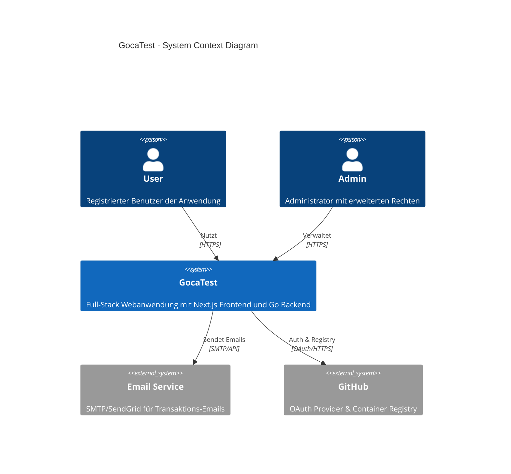
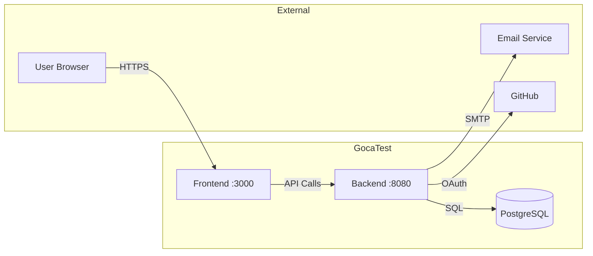

# System Context Diagram (C4 Level 1)

## Business Context

GocaTest ist eine Full-Stack Webanwendung mit:
- **Frontend**: Next.js 16 SPA für User Interface
- **Backend**: Go API für Business Logic
- **Database**: PostgreSQL für Persistenz
- **Auth**: Better Auth für Authentifizierung

## System Context Diagram

## Akteure

| Akteur | Beschreibung | Interaktionen |
|--------|--------------|---------------|
| **User** | Registrierter Benutzer | Login, CRUD Operationen, Dashboard |
| **Admin** | Administrator | User Management, System Settings |

## Externe Systeme

| System | Zweck | Protokoll |
|--------|-------|-----------|
| **Email Service** | Passwort Reset, Notifications | SMTP / REST API |
| **GitHub** | OAuth Login, Container Registry | OAuth 2.0 / HTTPS |

## Datenflüsse

## Sicherheitsgrenzen

- **Internet → Frontend**: TLS 1.3, kamal-proxy
- **Frontend → Backend**: Interne Kommunikation, Session Cookies
- **Backend → Database**: Verschlüsselte Verbindung (sslmode=require)
