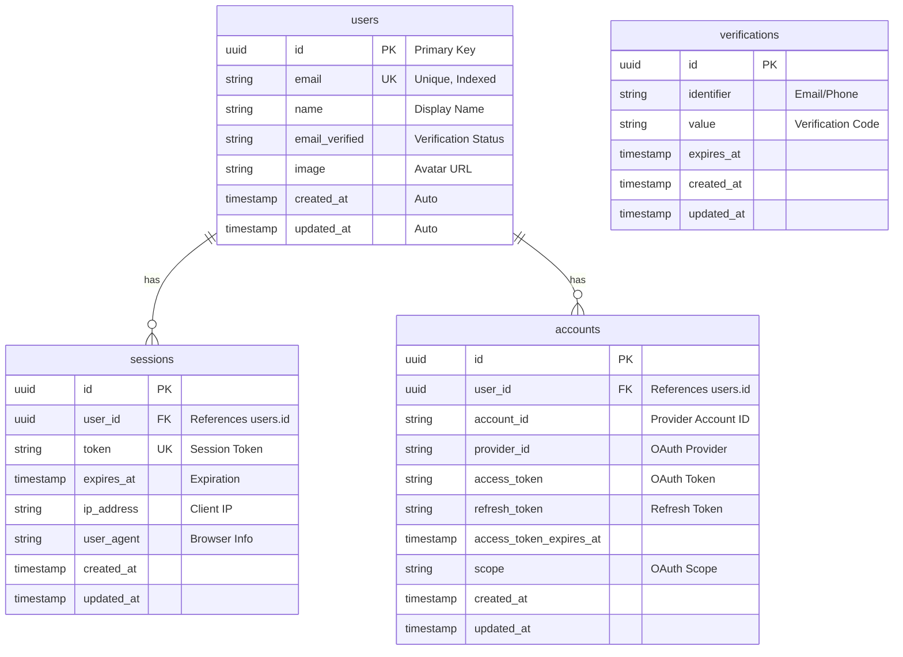
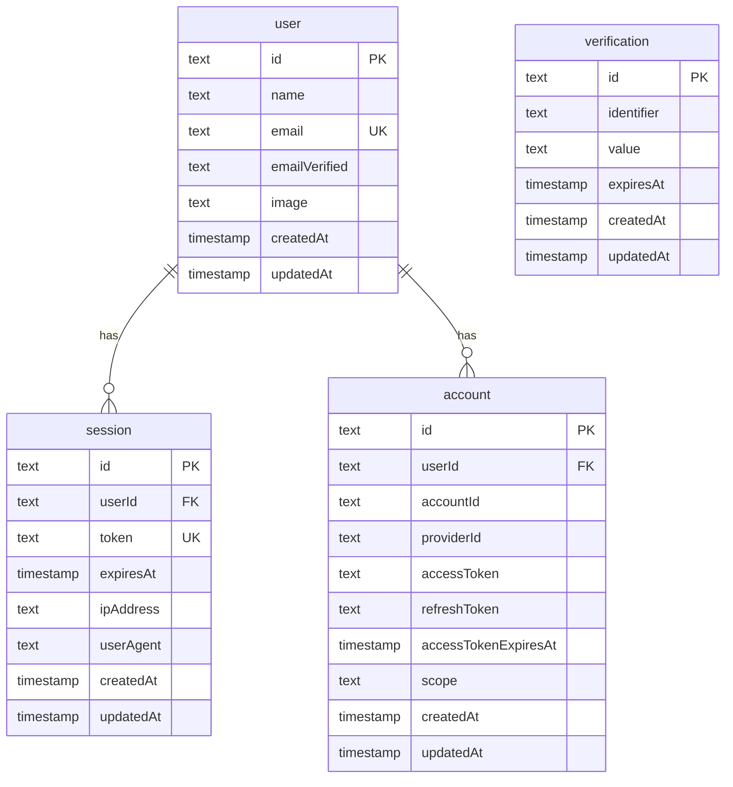
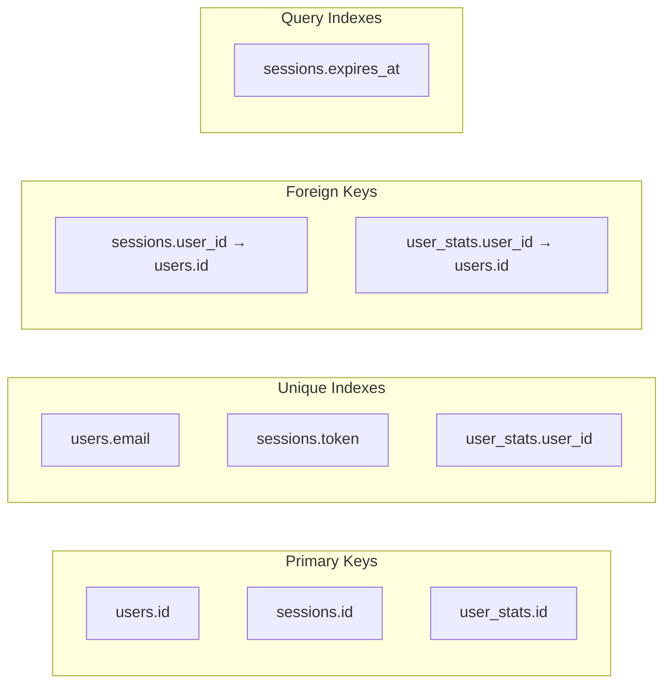
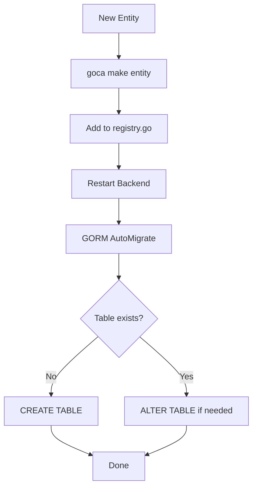

# Entity Relationship Diagram

## Database Schema

The ER diagram shows all database entities and their relationships.

## Core Entities



## Application Entities

```mermaid
erDiagram
    users ||--o| user_stats : "has"

    user_stats {
        uuid id PK
        uuid user_id FK UK "One per User"
        int projects "Project Count"
        int tasks "Task Count"
        int completed "Completed Tasks"
        timestamp created_at
        timestamp updated_at
    }

    %% Example: If you have more entities
    %% users ||--o{ projects : "owns"
    %% projects ||--o{ tasks : "contains"

    %% projects {
    %%     uuid id PK
    %%     uuid user_id FK
    %%     string name
    %%     string description
    %%     string status
    %%     timestamp created_at
    %%     timestamp updated_at
    %% }

    %% tasks {
    %%     uuid id PK
    %%     uuid project_id FK
    %%     string title
    %%     string status
    %%     timestamp due_date
    %%     timestamp created_at
    %%     timestamp updated_at
    %% }
```

## Better Auth Schema

Better Auth automatically creates these tables:



## Indexes



## GORM Model Mapping

```go
// Domain Entity → GORM Model → Database Table

type User struct {
    ID        uuid.UUID `gorm:"type:uuid;primaryKey"`
    Email     string    `gorm:"uniqueIndex;not null"`
    Name      string
    CreatedAt time.Time
    UpdatedAt time.Time

    // Relations
    Sessions  []Session
    UserStats *UserStats
}

type UserStats struct {
    ID        uuid.UUID `gorm:"type:uuid;primaryKey"`
    UserID    uuid.UUID `gorm:"uniqueIndex;not null"`
    Projects  int       `gorm:"default:0"`
    Tasks     int       `gorm:"default:0"`
    Completed int       `gorm:"default:0"`
    CreatedAt time.Time
    UpdatedAt time.Time

    // Relations
    User User `gorm:"foreignKey:UserID"`
}
```

## Migration Strategy



## Relationship Types

| Relationship | Example | GORM |
|--------------|---------|------|
| **1:1** | User ↔ UserStats | `hasOne` / `belongsTo` |
| **1:N** | User ↔ Sessions | `hasMany` / `belongsTo` |
| **N:M** | User ↔ Roles | `many2many` (Join Table) |
