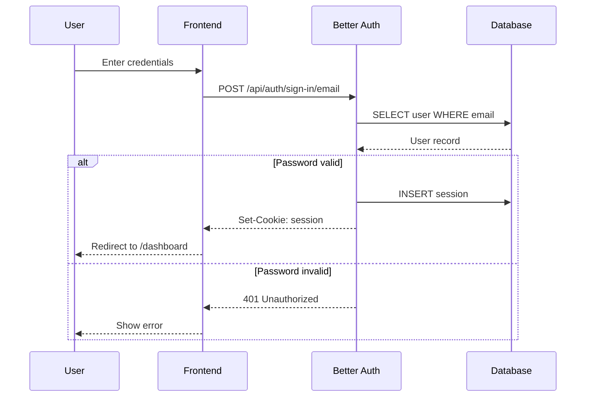
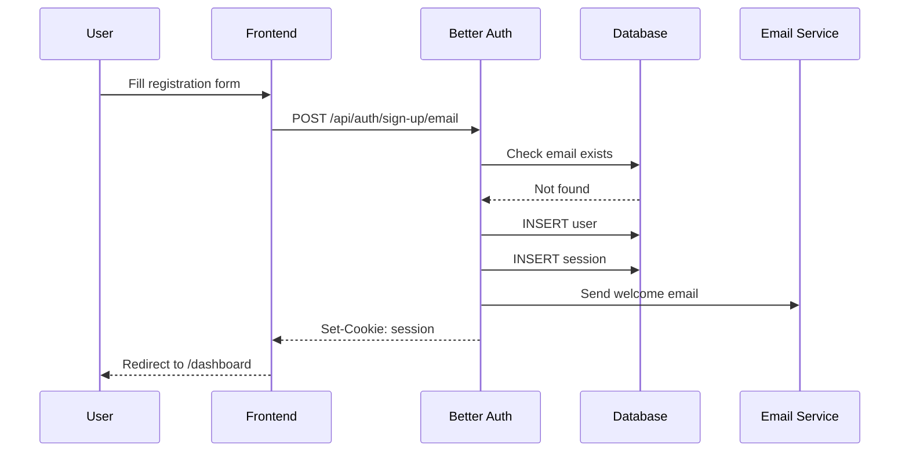
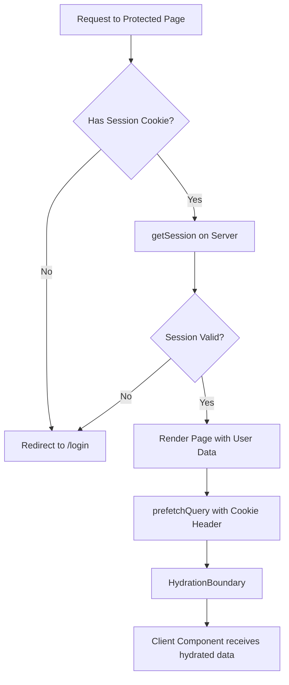
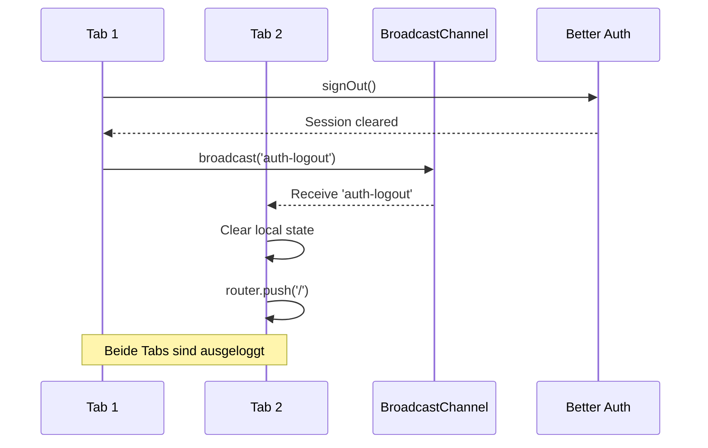
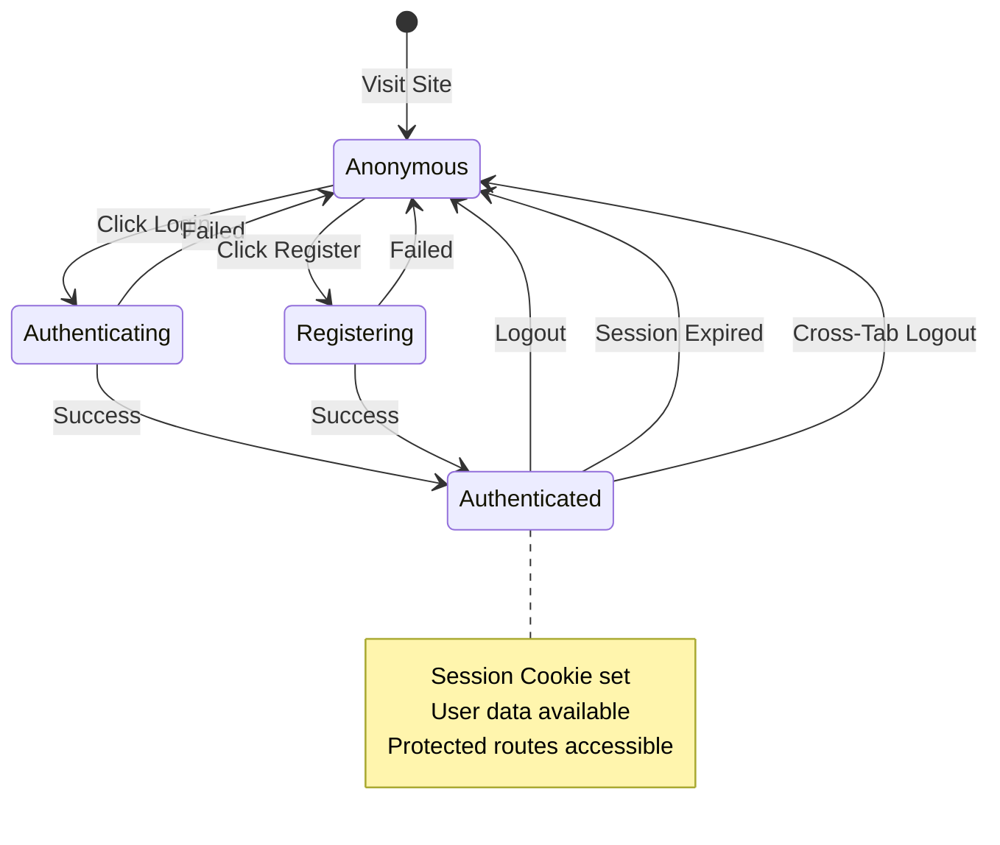
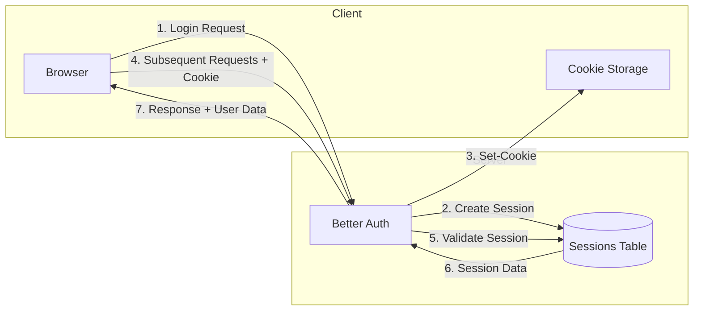

# Authentication Flow

## Business Logic

Die Authentifizierung basiert auf Better Auth mit:
- Email/Passwort Login
- Session-basierte Auth (Cookies)
- Cross-Tab Synchronisation
- Server-side Session Validation

## Login Flow

## Registration Flow

## Session Validation (Server Component)

## Cross-Tab Logout

## State Diagram: User Session

## Token/Cookie Flow

## Security Considerations

| Aspekt | Implementation |
|--------|----------------|
| **Cookie Flags** | HttpOnly, Secure, SameSite=Lax |
| **Session Storage** | Database (PostgreSQL) |
| **Password Hashing** | bcrypt (Better Auth default) |
| **CSRF Protection** | SameSite Cookie + Origin Check |
| **Rate Limiting** | Middleware (zu implementieren) |
