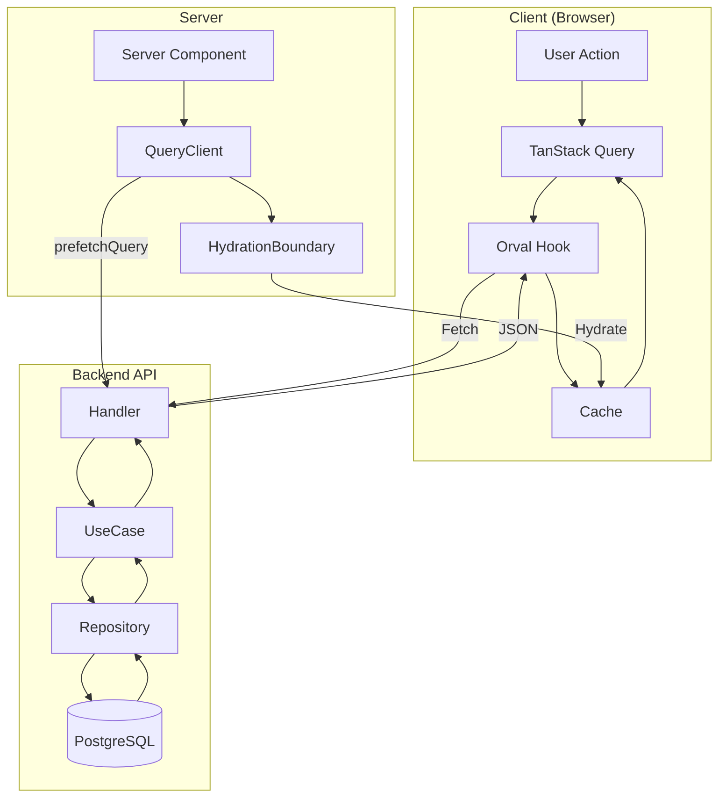
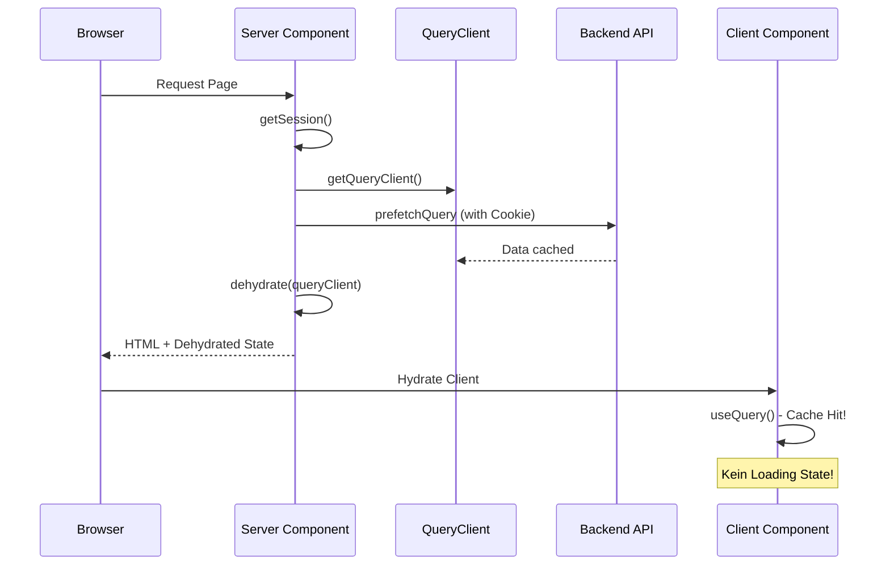
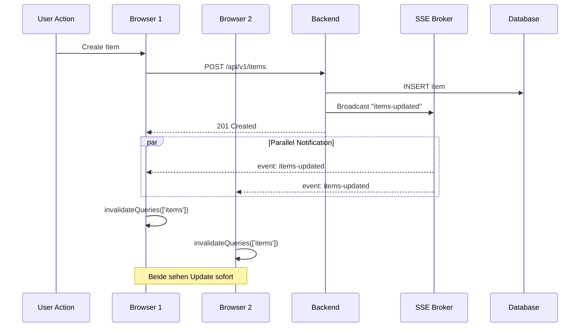
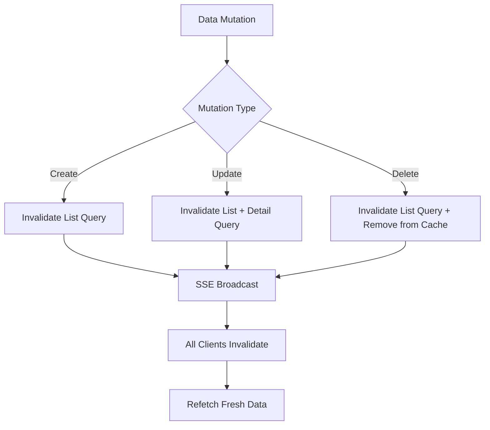
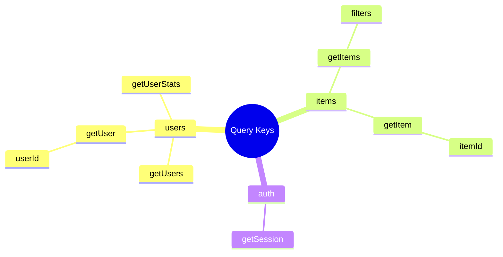
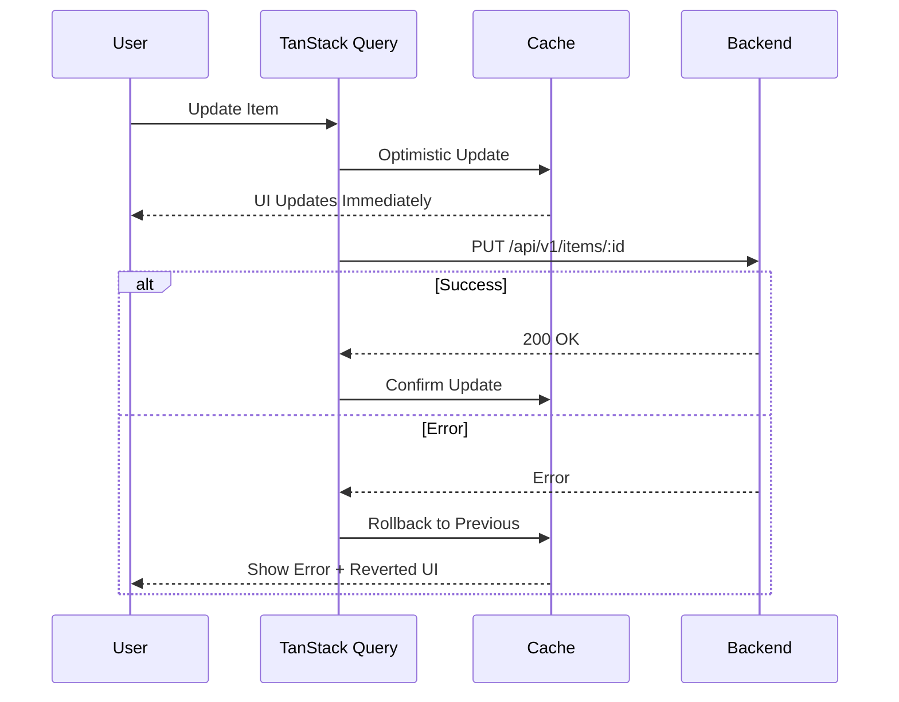
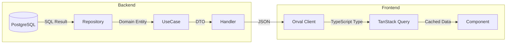
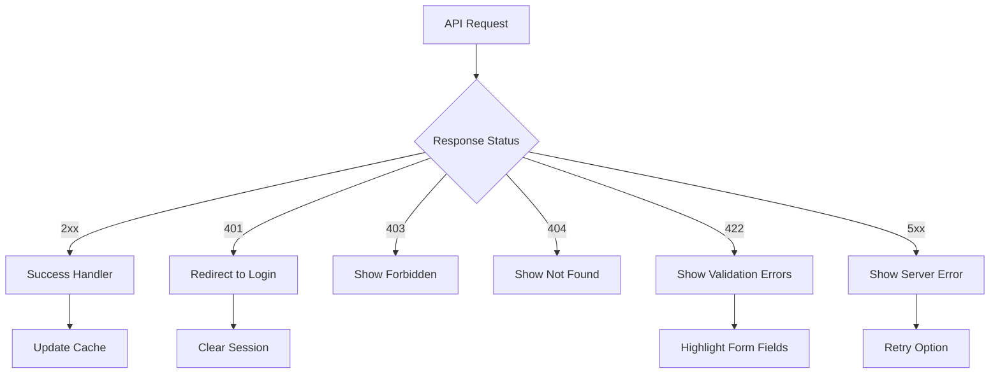

# Data Flow Architecture

## Overview

Datenfluss durch die Anwendung mit TanStack Query, HydrationBoundary und SSE.

## Request/Response Flow

## Server-Side Prefetching Pattern

## Real-Time Updates (SSE)

## Cache Invalidation Strategy

## Query Key Structure

## Optimistic Updates

## Data Transformation Pipeline

## Error Handling Flow

